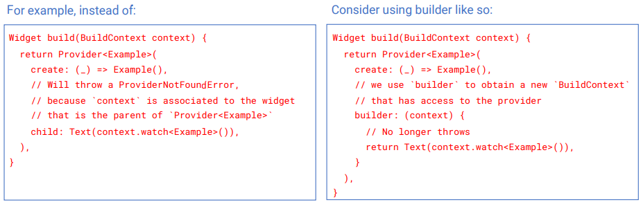
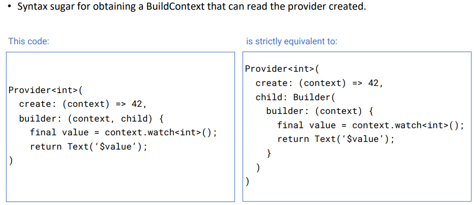

# 0. 정의
### 0-1 상태
 1. 상태(State)는 위젯이 빌드되는 동시에 읽을 수 있고, 위젯의 생명 주기동안 변경할 수 있는 정보를 말한다. 
 2. 보통 사용자와 어플의 상호작용으로 인해 변화하는 데이터들이 여기에 해당한다.
 3. 상태 관리가 만들어진 목적은, UI와 비즈니스 로직을 분리하기 위해서 이다.

### 0-9 기타
 1. BloC 비하면 Provider를 이해하는데 걸린 시간은 절반도 안 된다.
 2. Bloc 패턴은 사용하기에 진입장벽이 높고,  불필요한 클래스를 여러 개를 만들어야 한다.
 3. 구글에서 Bloc 패턴이 먼저 만들어지고, 불편함을 해소하거자 Provider가 나중에 만들어 졌다.

# 1. Provider
### 1-1 Provider Syntax
```dart
    Provider<T>({
        Key? key,
        required Create<T> create,
        Dispose<T>? dispose,
        bool? lazy,
        TransitionBuilder? builder,
        Widget? child,
    })
```

```dart
    //실사용예)
    class MyApp extends StatelessWidget {
    ......
    Widget build(BuildContext context) {
        return Provider<Dog>(
        create: (context) => Dog(name: 'Sun', breed: 'Bulldog', age: 3),
        lazy: true,
        child: MaterialApp(
            ......
            home: const MyHomePage(),
    ......
    }
```
### 1-2 Provider 정의
 1. 여러 Widget class에서 공통으로 사용되고, 변경되는 값들에 대해서 쉽게 사용할 수 있도록 해주는 Widget이다.
 2. Provider는 하위 Widget들의 공통되는 Parent Widget tree의 상위에 정의 한다.
 3. 변경되는 값들이 하위 Widget들에 자동 반여되기 위해서는 ChangeNotifier, notifyListeners(), listener등록 등이 되어야 가능하다.

### 1-3 Provider 속성설명
 1. Provider<T>
    - <T> 사용되는 type을 정의한다. 필수는 아니다.
    - 선언을 해놓으면 하위에서 사용도중 casting을 안해도 되기 때문에 유용하다.
 2. Key? key
    - 
 3. required Create<T> create
    - 
 4. Dispose<T>? dispose
    - 
 5. bool? lazy
    - default 값은 lazy=true이다.
    - 선언문장을 만났을 경우 Provider를 create구문 수행여부는 lazy 속성에 의해 결정 된다.
    - lazy=true; 이면, 선언시 create하지 않고 하위Widget class에서 해당 Provider type을 사용한다는 문장을 만나는 시점에 create를 하게 된다.
    - lazy=false; 이면, 선언과 동시에 create를 한다.
 6. TransitionBuilder? builder
    - 
 7. Widget? child
    - 하위 Widget class를 기술한다.

### 1-4 Provider 하위Widget(class)에서 사용문법 및 정의
 1. listen: false   
    - 사용문법] Provider.of<Dog>(context).name
    - Provider type으로 정의된 instance에 대한 값을 보여준다.
    - instance의 값이 변경되어도 재 반영(적용)되지는 않는다.

    - 예외, StatfullWidget이면서 setState()문장을 수행하면 변경된 값이 반영된다.    

 2. listen: true   
    - 사용문법] Provider.of<Dog>(context, listen: true).age
    - Provider listener로 등록 시켜준다.
    - Provider type으로 정의된 instance에 대한 값을 보여준다.
    - instance의 값이 변경되면 재 반영(적용)되어 보여준다.
    - 단, Provider type의 class가 ChangeNotifier를 상속받고, notifyListeners()를 호출해줘야 된다.

### 1-5 Provider Widget생성과정 및 진행 프로세스
 1. 진행 프로세스
    - Provider 정의시 생성(lazy:true)
    - 하위 Widget class에서 사용
    - Provider type으로 정의된 instance가 변경 시 notify를 해준다.
    - Listener의 class들은 rebuild 한다.
    - 참고, `Provider 정의시 생성 프로세스쪽으로 다시 호출 되지 않는다.`


# 2. ChangeNotifier
### 2-1 ChangeNotifier Syntax
 1. 크게 2가지 방법으로 개발가능하다.
 2. 첫번째 Syntax
  - ChangeNotifierProvider를 먼저 선언하고, 하위 Class Widget부터 사용하기
 ```dart
 //provider_pattern_udemy/step4_CangeNotifierProvider/dog_app_step4.dart
 class MyApp extends StatelessWidget {
  ...
  Widget build(BuildContext context) {
    return ChangeNotifierProvider<Dog>(
      create: (context) => Dog(name: 'dog04', breed: 'breed04'),
      child: MaterialApp(
        home: const MyHomePage(),
      ),);}
}
class _MyHomePageState extends State<MyHomePage> {
  @override
  Widget build(BuildContext context) {
    return Scaffold( ... ),
      body: Text('- name: ${Provider.of<Dog>(context, listen: false).name}')
    );}
}
 ```

3. 두번째 Syntax
  - ChangeNotifierProvider를 선언과 동시에 같은 Widget class에서 사용하기
  - ChangeNotifierProvider를 선언과 동시에 같은 Widget class에서 사용하려고 하면    
    반드시 ChangeNotifierProvider의 child: Builder(builder: (context) { ....}... 와 같이    
    정의 하여야 한다.     
    그렇지 않으면 오류가 발생한다.
   
```dart
//정상script (Builder callback을 사용한 경우)
class MyHomePage extends StatelessWidget {
  ..
  Widget build(BuildContext context) {
    return Scaffold(
      body: ChangeNotifierProvider<Counter>(
        create: (_) => Counter(),
        child: Builder(
          builder: (context) {
            return Column(
              children: [
                Text('${context.watch<Counter>().counter}'),
                ElevatedButton(
                  child: const Text('Increment'),
                  onPressed: () { context.read<Counter>().increment();  },
                )
              ],
            );
   ....
}
```  
```dart
//오류script (Builder callback을 사용하지 않은 경우)
class MyHomePage extends StatelessWidget {
  ..
  Widget build(BuildContext context) {
    return Scaffold(
      body: ChangeNotifierProvider<Counter>(
        create: (_) => Counter(),
        child: Column(
                 children: [
                   //이 context의 상위로 Provider.of를 찾으로 검색해보지만
                   //Provider.of를 찾지 못해서 오류가 발생한다.
                   Text('${context.watch<Counter>().counter}'),
                   ElevatedButton(
                     child: const Text('Increment'),
                     onPressed: () { context.read<Counter>().increment();  },
                   )
                 ],
               ),
   ....
}
```  


 1. 
### 2-2 ChangeNotifier 정의
### 2-3 ChangeNotifier 속성설명
### 2-4 ChangeNotifier 하위Widget(class)에서 사용문법 및 정의

### 2-5 Provider Widget생성과정 및 진행 프로세스

# 3. ChangeNotifierProvider
### 3-1 ChangeNotifierProvider Syntax
### 3-2 ChangeNotifierProvider 정의
### 3-3 ChangeNotifierProvider 속성설명
### 3-4 ChangeNotifierProvider 하위Widget(class)에서 사용문법 및 정의

### 3-5 ChangeNotifierProvider Widget생성과정 및 진행 프로세스

# 4. FutureProvider
### 4-1 FutureProvider Syntax
### 4-2 FutureProvider 정의
 1. FutureProvider는 두번 build된다.
    - 첫번째는 initialData를 기준으로 build된다.
    - 두번째는 create 쪽에서 Future값이 return된 후에 build된다.
 2. FutureProvider는 Future return value를 type으로 선언한다.    
### 4-3 FutureProvider 속성설명
### 4-3 FutureProvider 하위Widget(class)에서 사용문법 및 정의

### 4-5 FutureProvider Widget생성과정 및 진행 프로세스


# 5. StreamProvider
### 5-1 StreamProvider Syntax
### 5-2 StreamProvider 정의
 1. StreamProvider는 여러번 build된다.
    - 첫번째는 initialData를 기준으로 build된다.
    - 두번째는 create 쪽에서 Stream값이 return될때 마다 build된다.
 2. StreamProvider는 Stream return value를 type으로 선언한다.    
### 5-3 StreamProvider 속성설명
### 5-3 StreamProvider 하위Widget(class)에서 사용문법 및 정의

# 6. Route Access
### 6-1 Anonymous Route Access
 - /flutter_pattern/provider_pattern_udemy/step12_AnonymousRouteAccess/ 참조
### 6-2 Named Route Access
 - /flutter_pattern/provider_pattern_udemy/step13_NamedRouteAccess/ 참조
### 6-3 Generated Route Access
 - /flutter_pattern/provider_pattern_udemy/step14_GeneratedRouteAccess/ 참조
### 6-4 Global Route Access
 ```dart
  return Provider<T> (
    create: (_) => T(),
    child: MaterialApp(..)
  );
 ```

# 7. ProxyProvider
### 7-1 ProxyProvider Syntax
```dart
  ProxyProvider({
      Key? key,
      Create<R>? create,
      required ProxyProviderBuilder<T, R> update,
      UpdateShouldNotify<R>? updateShouldNotify,
      Dispose<R>? dispose,
      bool? lazy,
      TransitionBuilder? builder,
      Widget? child,
    })
```
 1. create
    - 한번만 호출 된다.
    - create가 optional 한 이유는 다른 Provider에서 사용하기 위해서만 필요하다면 사용하지 않아도 된다.
     
 2. update
    - 여러번 호출 될 수 있다.
    - ProxyProvider는 다른 provider의 value에 의존하기 때문이다.
    - update가 호출 되는 3가지 조건
      . 첫번째, ProxyProvider가 의존하는 Provider의 value를 처음으로 얻을 때
      . 두번째, ProxyProvider가 의존하는 Provider의 value가 변경 될때 마다
      . 세번째, ProxyProvider가 rebuild될 때 마다
 
          
### 7-2 ProxyProvider 정의
 1. 다른 Provider의 값을 사용할 수 있다.
 2. ProxyProvider는 다른 provider의 value에 의존한다.  
    즉, 다른 value가 변하게 되면 새로 만들어야 된다는 뜻이다.
    
### 7-3 ProxyProvider 속성설명
### 7-3 ProxyProvider 하위Widget(class)에서 사용문법 및 정의


# ?. ????
### ?-1 ???? Syntax
### ?-2 ???? 정의
### ?-3 ???? 속성설명
### ?-3 ???? 하위Widget(class)에서 사용문법 및 정의


# 90. Provider Exception
### 1. Error내용
 The following ProviderNotFoundException was thrown building MyHomePage(dirty):
Error: Could not find the correct Provider<Foo> above this MyHomePage Widget    

This happens because you used a `BuildContext` that does not include the
provider of your choice. There are a few common scenarios:    

 - 위 Error에 대한 3가지 시나리오
 1. 시나리오 : You added a new provider in your `main.dart` and performed a hot-reload.
To fix, perform a hot-restart.
 - 해결방법

 2. 시나리오 : The provider you are trying to read is in a different route.   
Providers are "scoped". So if you insert of provider inside a route, then
other routes will not be able to access that provider. 
 - 해결방법

 3. 시나리오 : You used a `BuildContext` that is an ancestor of the provider you are trying to read.
Make sure that MyHomePage is under your MultiProvider/Provider<Foo>.
This usually happens when you are creating a provider and trying to read it
immediately. 
  - 해결방법 : 왼쪽처럼 하지 말고, 오른쪽처럼 buildr를 사용하면 된다.
 

 - biilder property 메뉴얼
   . Syntax sugar for obtaining a BuildContext that can read the provider created.
 


### 3. 
 - Error내용
 - 해결방법

### 6-2 StreamProvider 정의
 1. StreamProvider는 여러번 build된다.
    - 첫번째는 initialData를 기준으로 build된다.
    - 두번째는 create 쪽에서 Stream값이 return될때 마다 build된다.
 2. StreamProvider는 Stream return value를 type으로 선언한다.    
### 6-3 StreamProvider 속성설명
### 6-3 StreamProvider 하위Widget(class)에서 사용문법 및 정의