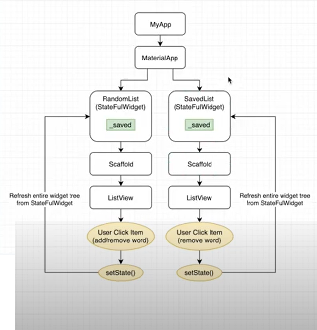
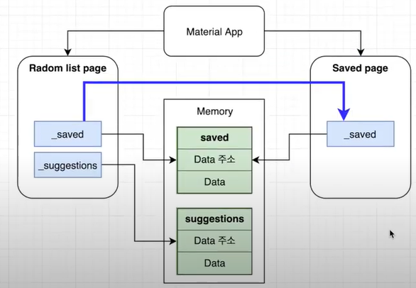
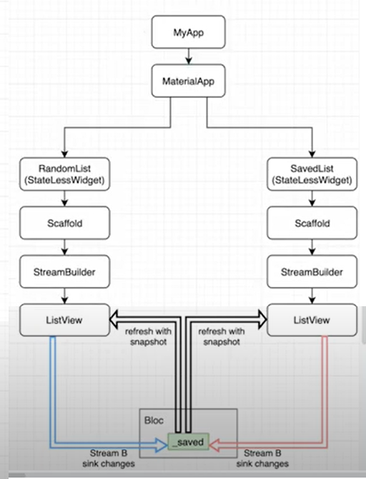
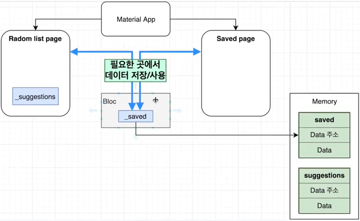

# Bloc Pattern

## 0. 강의, 참조 site
 - 선행 URL : https://youtu.be/2iWJRAcEsaQ 
 - 아래 Block Pattern을 듣기 전에 위 영상을 먼저 봐야됨. 아래 강의소스가 위 강의 소스를 가지고 진행하기 때문
 - Bloc Pattern 강의 URL : https://www.youtube.com/watch?v=EKwVNTyRPq0  (코딩 파파)

## 1. Stream이 없이 작동 되는 경우
 - setStatus api를 사용해야 됨
 - flow

 - 개발폴더 : /lib/block_pattern_010_no_stream
 - _saved 변수를 Main dart소스에 초기 선언하고
 - _saved 변수를 Sub dart소스에 넘겨준다.(객체이므로 referrence 방식으로 전송)
 - setState() api를 사용한다.

## 2. Bloc pattern   (Business Logic Component Pattern)
 - Stream을 이용한 작동 방식
 - flow
 - Stream은 Bloc pattern하고 같이 사용한다.
 - StreamBuilder widget을 사용하여 개발한 프로세스
 - StreamBuilder widget을 사용하여 상태관리를 한다. (setState() api는 사용하지 않는다.)
 - _saved값이 추가/삭제 될 경우 전체 widget tree를 다 그리는게 아니고 ListView만 다시 그린다.
 - _saved값이 변경 되면 바로 _saved가 사용되고 있는 양쪽 dart소스의 ListView로 보내주면서 refresh해준다.

 - flow

 - Bloc안에 저장공간주소를 저장한다.
 - 저장공간의 주소를 어떤 Page에서든 가져다 사용할 수 있게 해준다.
