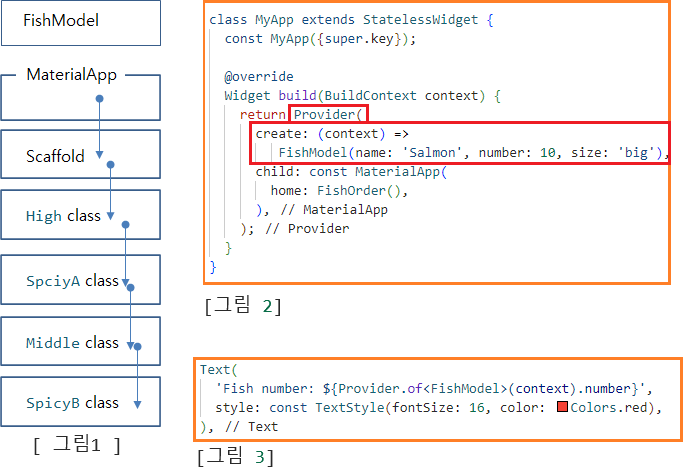
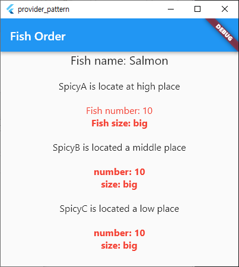

# Provider Pattern
## 1. Provider Pattern 정의 
 - 객체에서 객체로 값을 넘길때 보통은 argument방식으로 객체(VO)를 넘긴다.
 - argument방식으로 객체를 넘기게 되면 소스가 지저분해 질 수 있다.
 - 이때 Provider를 이용하게 되면 argument로 넘기기 않고도  객체(VO)를 사용할 수 있다.

## 2. Provider Pattern 사용 목적
 - 단계별로 호출 되는 Class에서 argument로 값을 넘기지 않고, Provider를 이용해서 객체를 공유해서 접근할 수 있다.

## 3. Provider Pattern 불가 형태
 - 1. 가능형태 : 한소스, 한파일, 하나의 Dart파일내부에 정의된 class들에서만 Provider Pattern형식이 공유 된다.
 - 2. 불가형태 : 다른 Dart파일에 존재하는 Class를 호출 하는 경우에는 Provider Pattern으로 정의 했어도 공유되지 않는다.

## 4. 개발소스
 - /lib/provider_pattern_100/fish_model.dart
 - /lib/provider_pattern_100/provider_patter_100.dart

## 5. 실행결과, 소스 흐름도 및 설명
 - 실행결과
 > 

 - 소스 흐름도 및 설명
 > 

## 6. 소스 상세 설명 (위 이미지를 기준으로 설명)
### 1. 호출 구조 (그림 1)
 - 1. MaterialApp Class에서 Scaffold Class호출
 - 2. Scaffold    Class에서  High    Class 호출
 - 3. High        Class에서 SpciyA   Class 호출
 - 4. Middle      Class에서 SpicyB   Class호출
 - .. 즉, Class내부에서 다른 Class를 계속 해서 호출 한다.

### 2. 기본 자료 흐름 (그림 1)
 - 1. MaterialApp class에서 생성한 FishModel 모델 객체를 SpicyB class까지 넘기려면 객체 생성시점에 argument를 통해 넘겨야 된다.

### 3. Provider 사용 시 자료 흐름 (그림 2),  (그림 3)
 - 1. 화면 최상의의 MaterialApp() Widget을 Provider로 감싼다.
 -    이로써 MaterialApp하위 모든 위젯에서 FishModel instance에 접근을 할 수 있게 된다.
 -    즉, 자료를 넘겨줄 수로가 생기는 것이다.
 - 2. (constext) 를
 - 3. create: 인자를 통해서 FishModel을 생성 후 생성된 instance를 하위 class들에서 사용할 수 있도록 해준다.
 - 4. ${Provider.of<FishModel>(context).number
 -    하위 class에서는 argument를 받지 않았지만 위와 같은 형식으로 해당 instance와 member들을 사용할 수 있다.

 > 1. 화면 최상의의 MaterialApp() Widget을 Provider로 감싼다.
 >    이로써 MaterialApp하위 모든 위젯에서 FishModel instance에 접근을 할 수 있게 된다.
 >    즉, 자료를 넘겨줄 수로가 생기는 것이다.
 > 2. (constext) 를
 > 3. create: 인자를 통해서 FishModel을 생성 후 생성된 instance를 하위 class들에서 사용할 수 있도록 해준다.
 > 4. ${Provider.of<FishModel>(context).number
 >    하위 class에서는 argument를 받지 않았지만 위와 같은 형식으로 해당 instance와 member들을 사용할 수 있다.
