# 0. Provider 정의
### 1. 강의
 - udemy.com
 - 조상욱강사 ()
 - 유튜브 : 헤비프랜 (Heavy Fran)
### 1. 종류


### 2. 정의 및 특징, Topic
 - Provider 는 상태관리자의 기본이다.
 

 1. Why Provider : 왜 provider를 해야 되나    
 2. Accessing data easily : provider를 이용해서 어떻게 widget tree에서 쉽게 data를 access할 것인지 알아보기
 3. Listening to changes in data : widget tree에서 어떻게 data 변경에 대해 listen하는지 알아보기
 4. ChangeNofierProvider : 
 5. read, watch, select extension methods : data를 쉽게 관찰할 수 있는 방법 알아보기
 6. MultiProvider : 여러게 provider 알아보기
 7. FutureProvider : 
 8. StreamProvider : 연속적으로 변하는 값을 listen하고, widget을 rebuild하고 싶을때 하는 방법 알아보기
 9. Consumer :
 10. Selector : Consumer와 widget과 비슷하지만, 좀더 세세하게 제어하는 widget에 대해 알아보기
 11. Provider Access(.value provider) :
 12. ProxyProvider : 한 Provider에서 다른 Provider에 access해야 되는 경우에 사용하는 방법 알아보기
 13. errors : 다양한 error 대처방법
 14. addPostFrameCallback : 
 15. on-time action* & addListener of ChangeNotifier : stat에 변화가 생겼을 때 widget을 rebuild하는 것이 아니라, showdialog나 Navigator.push...등과 같은 action을 ChangeNotifier의 addListener를 활용해 처리하는 방법 알아보기

 * 추가사항    
 16. StateNotifier and StateNotifierProvider : 


### 3. Why Provider
 1. 상태관리자이다.
 2. 사용이유 및 방법
```dart
    - [왼쪽이미지]   
      . WidgetA에 increment method가 존재 하고, counter를 증가시킨다.   
      . 이때 이 counter를 WidgetB에 전달하려면 어떻게 해야 될까?
    - [오른쪽이미지]   
      . WidgetA와 WidgetB에서 필요로하는 함수 및 데이터를 공통Parent인 WidgetC로 옮긴다.
      . 그 함수 및 데이터를 WidgetA 와 WidgetB로 내려준다.
      . Inversion of control 이란 : 함수는 내가(WidgetC) 정의 하는데 실행은 남(WidgetA)이 시킨다.
      . increment method는 WidgetC에 존재 하지만 그 실행은 WidgetA에서 한다.

      . 데이터(counter)를 WidgetC에서 WidgetB로 넘겨줄려면, WidgetD를 거처서 넘겨줘야 된다.
      . 이는 개발에 상당히 불편함이 존재 할 수 있다.
```

   
   
   
   
   
   
   
   
# 1. Counter App만들기 (step1) - Provider 미사용
 - [ [참고소스](./lib/step1_counter_app/counter_app_step1.dart) ]

### 1. 정의
 - Provider를 사용하지 않은 counter개발소스 app

### 2. Counter App - Widget Tree 및 실행화면


### 3.  단점
 1. Middle class는 counter값을 사용하지 않는데도, CounterB에 전달하기 위해서 받아서 넘겨줘야 된다.
 2. increment method를 Parent에 정의해야 되고, inversion of control기능을 이용해서 method를 refrence로 넘겨서 수행해야 된다.   
    소스가 직관적이지 않다.
 3. MyHomePage에서 counter값이 변경되고,  setState()를 해야 된다. 이렇게 되면 MyHomePage아래의 모든 Widget Tree가 rebuild된다.
 4. 실재 rebuild되는 소스코드가 해당위치(CounterB)에 존재 하지 않고, 상위에 존재 하기 때문에 소스 Tracking하기가 쉽지 않다.
 5. Widget Tree의 depth가 길어지만 method및 데이터를 계속 전달시켜줘야 된다.
   
   
   
   
   
   
   
# 2. Dog App만들기 (step2) - Provider 사용 - (ChangeNotifier 미사용)
 - [ [참고소스](./lib/step2_Provider/dog_app_step2.dart) ]

### 2-1 상태관리(State Management) 정의
 1. Dependency Injection기능 사용하기
    - Object를 Widget tree상에서 쉽게 access할 수 있도록 해주는 기능이다.   
 2. Synchronizing data and UI 기능 사용하기
    - 데이터와 UI를 동기화 시켜주는 기능이다.
    - 
### 2-2 Provider 정의
 1. Provider는 중간(필요없는) widget을 거치지 않고, 필요한 Widget에 쉽게 method및 데이터를 전달할 수 방법을 제공한다.
 2. 필요한 Widget만 rebuilding될 수 있도록 한다.
 3. 다른말로, Business와 Logic을 불리한다 하고도 한다.
    . (BLOC : Business LOgic Component)
 4. Provider를 정의한 상위 Widget에서는 하위 Provider를 사용할 수 없다.


 5. Provider 선언 Sciprt 및 주요특징
```dart
class MyApp extends StatelessWidget {
  ...
  Widget build(BuildContext context) {
    return Provider<Dog>(
      create: (context) => Dog(name: 'Sun',breed: 'Bulldog',age: 3),
      child: MaterialApp(.....),
  ....
}
```
   - Provider도 Widget이다.
   - `Widget이기 때문에 처음 build될때 한번만 수행(생성)된다.`
   - 이 특징으로 생각 해보면    
     

### 2-3 개발필요사항
 1. provider: ^6.0.4
 
### 2-4 소스 Widget Tree

 
 1. Dos class의 데이터 및 Method를 여러 Widget들에서 필요로 하고 있다.
 2. 사용되고 있는 Widget들의 공통되는 최상위(Parent)에 Provider를 추가한다.

### 2-5 Provider 기본 문법 - (ChangeNotifier 미사용)
1. Provider Constructor
```dart
  Provider({
    Key? key,
    required Create<T> create,      <<--required
    Dispose<T>? dispose,
    bool? lazy,
    TransitionBuilder? builder,
    Widget? child,
  })
  - lazy:true : 선언시에는 Provider가 수행되지 않는다.    
                Provider를 한번이라도 사용되는 Widget을 만났을 경우 Provider선언문장이 수행된다.
  - lazy:false : 선언과 동시에 Provider 선언문장이 수행된다.
```
### 2-6 Provider 개발 진행 과정
 1. 실행화면
  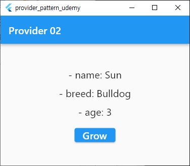
   - [Grow] 버튼을 눌러도 age는 변경되지 않는다.

 2. 주요소스
  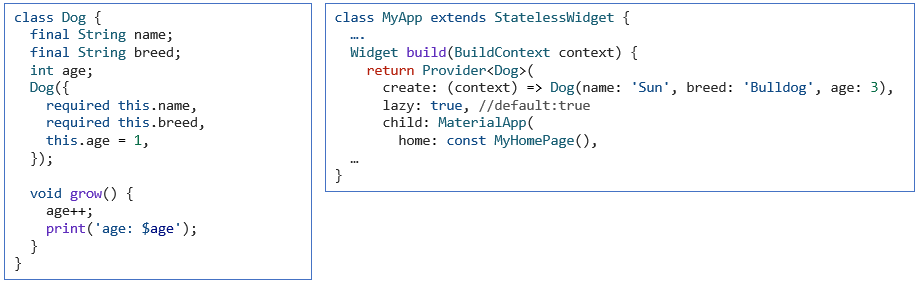

 3. 하위 Widget들에게 전달하고 싶은 Model(Dog) 정의
    - Model정의 시 ChangeNotifier 및 notifyListeners() 기능을 사용하지 않았다.
    - 이로 인해 Model(Dog)의 어떠한 값이 변경되어도    
      dog속성값들을 사용되고 있는 Widget들에게 전달(즉,rebuild)되지 않는다.
 4. Provider 선언
    - 사용되고 있는 Widget들의 공통되는 최상위(Parent)에 Provider를 추가한다.... 라고 했는데    
      개발 되는 소스들을 보면 실제적으로 정의 하는 소스 위치는 공통되는 최상위Widget의 상위이다.
    - 그러면서 Provider() widget의 Child로 공통되는 최상위 Widget을 위치시키는 구성으로 되어 있다.

 5. 하위 Widget에서 Provider기능 사용하기
   - Provider에는 of라는 static함수가 존재 한다.
   - 이 of함수는 Widget tree를 위로 traverse 하면서 원하는 type의 instance를 찾아서 주는 역할을 담당한다.   
     그래서 of함수에는 찾고자 하는 Type의 instance를 줘야 된다.    
   - of함수의 argument로는 context를 줘야 된다.
     context를 주는 이유는 context를 통해 Widget tree를 위로 탐색해야 되기 때문이다.
   - Provider.of<Dog>(context) : 와 같이 기술하게 되면 Dog class의 instance를 제공해 준다.
   - Provider.of<T>(context) : T type의 instance를 제공해 준다.
   
   
   
   
   
   
   
   
# 3. Dog App만들기 (step3) - (Provider 미사용 )- (ChangeNotifier 사용)
- [ [참고소스 - dog model](./lib/step3_ChangeNotifier/models/dog.dart) ]
- [ [참고소스 - main](./lib/step3_ChangeNotifier/dog_app_step3.dart) ]
### 3-1 주요소스 및 Widget Tree
 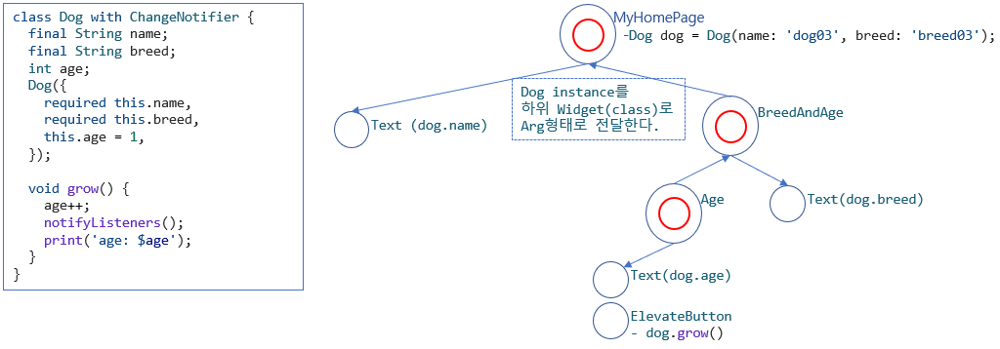

 1. ChangeNotifier와 notifyListeners() 기능은 사용했다.
 2. 하지만, Provider Widget을 정의하지 않아 listner가 없어, dog model값이 변경되어도 반영되지 않는다.
 3. 위 소스상에서 age가 변경 시 적용할 수 있는 방법은
    - Age class를 StatefullWidget으로 정의하고, [Grow]버튼 클릭 시 setState(){}를 해줘면 된다.
    - 그런데, 이렇게 하지 않은 이유는 현재 챕터에서는 Provider를 사용하지 않았을때 dog model값이 변경 되어도   
       자동으로 반영되지 않는다는걸 보여주기 위해서 위와 같이 개발한 것이다.

### 3-2 ChangeNotifier 상속받아 사용하기
  - notifyListeners()라는 void method : 를 기술하게 되면 
  - ChangeNotifier에 의해 상속받은 class의 값이 변동 되었을때,   
    notifyListeners()라는 void method를 호출하게 되면      
    ChangeNotifier를 listen하고 있는 모든 Widget들에게 변동사항을 알려준다.   
  - listener 등록방법   
    . ChangeNotifier에는 addListener()를 method가 있는데 이 method를 통해 callback함수를 등록하면 된다.   
    . 이렇게 callback함수로 등록 되면 ChangeNotifier로 상속받은 class가 변경이 되면      
      매번 호출 하게 된다.   
  - addListener() 주의사항   
    . Widget이 종료 될때 listen하고 있는 widget들이 자동으로 dispose되지 않기 때문에 반드시 dispose를 해줘야 된다.    
    . removeListener() method를 이용한다.  

 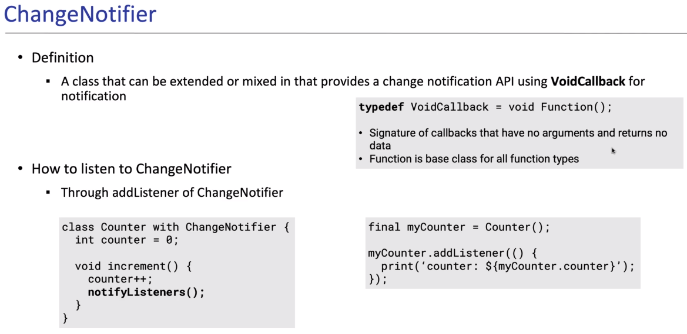
   
   
   
   
   
   
   
# 4. Dog App만들기 (step4) - (ChangeNotifierProvider 사용)
 0. 강의
    - https://www.udemy.com/ > Flutter Provider Essential 코스 (Korean)  
    - 10. Chapter 10. ChangeNotifierProvider
    - [ [참고소스 - dog Model](./lib/step4_CangeNotifierProvider/models/dog.dart) ]
    - [ [참고소스 - Main](./lib/step4_CangeNotifierProvider/dog_app_step4.dart) ]

### 4-1. 작동과정
 - 첫번째, ChangeNotifier의 인스턴스를 만든다.
 - 두번째, ChangeNotifier를 필요로하는 Widget에 ChangeNotifier를 쉽게 access할 수 있는 수단을 제공하고 필요하면 UI를 rebild한다.
 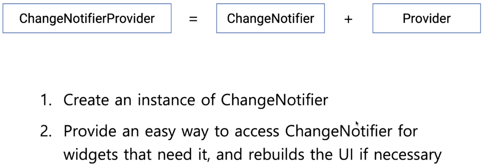

### 4-2. 추가 작동과정 상세내용
 - 첫번째, ChangeNotifier의 인스턴스를 만든다.
   * ChangeNotifier의 인스턴스를 필요할 때 만든다.
   * ChangeNotifier가 필요없을 경우 Memory에서 없애 준다.
 - 두번째, ChangeNotifier를 필요로하는 Widget에 ChangeNotifier를 쉽게 access할 수 있는 수단을 제공
   * Constructor를 통해 instance를 전달할 필요 없이 Provider.of를 통해서 ChangeNotifier의 instance에 쉽게 access할 수 있다.
   * type T의 instance를 access할 때 2가지 방법으로 access할 수 있다.
     1. Provide.of<T>(context)를 통해서는 type T의  ChangeNotifier instance의 변화를 listen해서 변화가 있으면 UI를 rebuild할 수 있다.
     2. Provide.of<T>(context, listen:false) 를 통해서는 ChangeNotifier instance를 access만 하고, 변화를 listen하지 않는다. 즉, 해당 UI를 rebuild하지 않는다.
 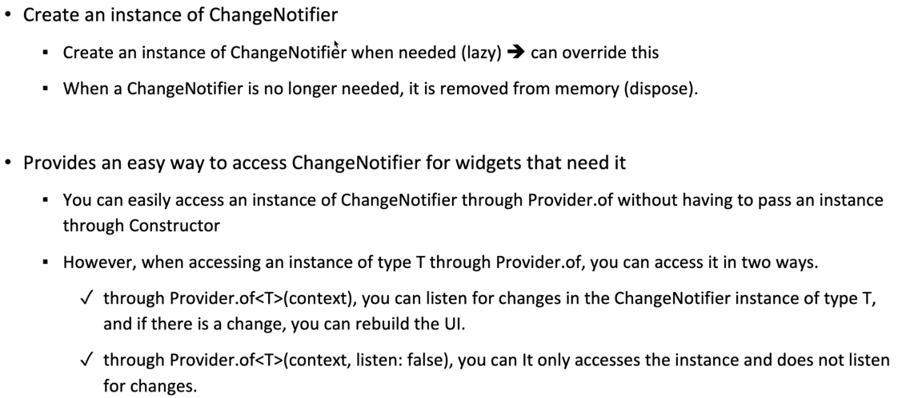

### 4-3. ChangeNotifierProvider 개발 진행 과정
 1. Dog Model
```dart
  class Dog with ChangeNotifier {
    final String name;
    final String breed;
    int age;
    Dog({
      required this.name,
      required this.breed,
      this.age = 1,
    });

    void grow() {
      age++;
      notifyListeners();
    }
  }
```

 2. ChangeNotifierProvider 정의 하기
```dart
  class MyApp extends StatelessWidget {
    ...
    Widget build(BuildContext context) {
      //ChangeNotifierProvider<Dog>
      //   - MaterialApp Widget안에 모든 Widget에서 Dog instance를 access할 수 있다.
      //   - 또한 데이터가 변경 시 rebuild를 할 수 있다.
      return ChangeNotifierProvider<Dog>(
        create: (context) => Dog(name: 'dog04', breed: 'breed04'),
        child: MaterialApp(
          ...
          home: const MyHomePage(),
        ),
      );
    }
  }
```

 3. Dog instance를 하위 Widget에서 사용하기
  - Dog.name은 한번 화면에 보여준 후 변경되지 않기 때문에 해당 Widget은 rebuild될 필요가 없다.   
    그래서, listen:false 속성을 적용해서 Dog class의 값이 변경 되어도(notifyListeners()이 호출되어도)   
    listen하지 않겠다고 정의한 것이다.
```dart
  class BreedAndAge extends StatelessWidget {
    ....
    Text( '- name: ${Provider.of<Dog>(context, listen: false).name}',
    ...
  }
```

 4. Dog instance값을 변영하고, 를 하위 Widget에서 사용하기
  - age는 변경 시 해당 Widget tree는 rebuild되어야 한다.
  - 그래서, listen:true(defalt)속성처리를 해준다.   
    이로써, Age class는 listener가 되는 것이다.
  - Grow 버튼을 누르면 grow() method를 수행하고, notifyListeners()이 호출되어
  - listen하고 있는 Widget tree들을 rebuild하게 된다.
```dart
  class Age extends StatelessWidget {
    ....
    Widget build(BuildContext context) {
          Text('- age: ${Provider.of<Dog>(context).age}'),
          ElevatedButton(
            onPressed: () => Provider.of<Dog>(context, listen: false).grow(),
            child: const Text('Grow', style: TextStyle(fontSize: 20.0)),
    ...
  }
```
   
   
   
   
   
   
   
# 5. Dog App만들기 (step5) - (Provider - Extension method)
 0. 강의
    - https://www.udemy.com/ > Flutter Provider Essential 코스 (Korean)  
    - 11. Chapter 11. read, watch, select extension methods
    - [ [참고소스-dog model](./lib/step5_ProviderExtensionMethod/models/dog.dart) ]
    - [ [참고소스-main](./lib/step5_ProviderExtensionMethod/dog_app_step5.dart) ]

### 5-1. 정의
  - Provider는 BuildContext를 Extend한 method를 포함한다.
  - BuildContext는 Widget Tree상에서 Widget의 위치에 대한 reference를 가지고 있는 Object이다.
    이 reference를 통해서 Widget tree위를 처다 볼 수 있다.   
    즉. Widget Tree상에서 type T를 찾는 행위가 가능한것이다.
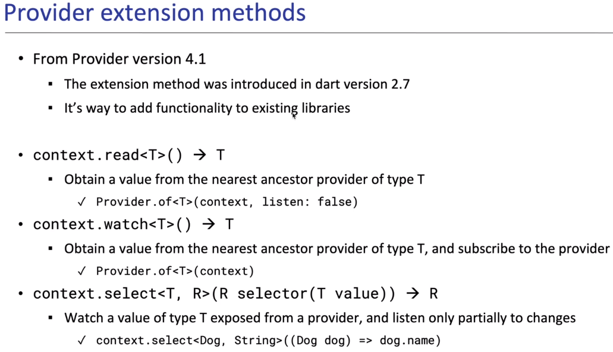
    
### 5-2. Extendsion method
 1. context.read<T>() -> T
    - Provider.of<T>(context, listen:false) 와 동일한 기능이다.
    - 해당 instance가 변경 되어도 listen하지 않는다.
 2. context.watch<T>() -> T
    - Provider.of<T>(context) 와 동일한 기능이다.
    - 해당 instance가 변경 되면 listen한다.
    - context.watch는 값 하나만 변경되어서 listen하고 있는 Widget은 모두 rebuild하게 된다.
 3. context.select<T,R>(R selector(T value)) -> R
    - 속성을 많이 가지고 있는 instance에서 특정 Property들만의 변화만 listen하고 싶을 경우에 사용한다.
    - context.select는 정의된 Property만 변경 될때 Widget이 rebuild하게 된다. (즉, 선별되어 rebuild된다.)

### 5-3. Widget tree와 실행화면
 - ChangeNotifierProvider 정의
```dart
  class MyApp extends StatelessWidget {
    …….
    Widget build(BuildContext context) {
      return ChangeNotifierProvider<Dog>(
        create: (context) => Dog(name: 'dog05', breed: 'breed05', age: 3),
        child: MaterialApp(
          home: const MyHomePage(),
    …….
  }
```
 - 1. Widget tree
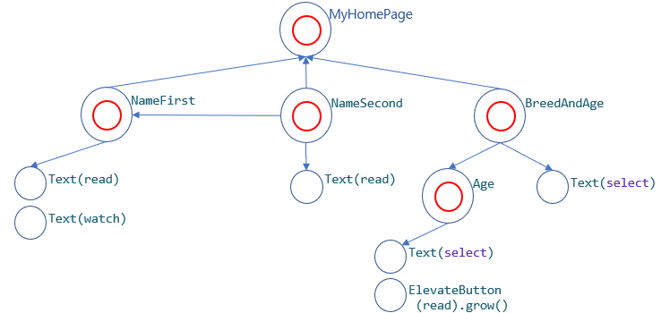

 - 2. 실행화면
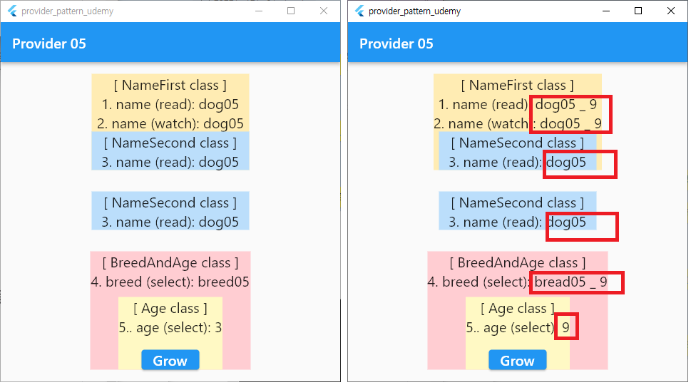

 1. 위 [2. Extendsion method] 설명을 보면    
    read는 처음 한번만 읽고 lesten하지 않고,   
    watch는 변경사항을 계속 listen하고 있고,     
    select는 명시한 하나의 항목만 listen한다 라고 했다.
 2. 하지만 위 실행하면을 보면 다르게 출력된다.
 3. [NameFirst] cass에서, read, watch 2개 Text Widget을 출력해보면 동일하게 Watch하고 있다.    
    이건 Text, read, watch, ChangeNotifierProvider 의 특징인데.. 아직 정확하게는 어느것 때문에 이렇게 동작하는지 모르겠다.   
    `하지만 한가지 명확한 건 watch로 구성된 Class(Widget)는 전체 rebuild된다.`
    `그래서, NameFirst class에서 dog.name이 read이건, watch이건 동일하게 보여진다.`
 4. [NameSecond] class는 [MyHomePage, NameFirst] class 두 곳에서 불려지고 있다.    
    이렇게 개발할 일은 거의 없지만, 테스트 해보려고 구성해 봤다.   
 5. 위 3번에서 watch method에 의해 name이 변경 되면 MyHomePage] class는 rebuild 된다고 했다.    
    `[MyHomePage] class에서 child인 Widget들은 모두 렌더링되지만, [NameSecond] class는 rebuild되지 않는다.`   
    그래서 [NameSecond]안에 있는 dog.name은 read method의 해서 초기 한번만 보여주고,    
    변경된 name은 반영되지 않는다.   
    `고로, 일반 Widget은 rebuild될때 모두(?) 렌더링 되지만, Class Widget은 해당 Class의 구성에 따라서 rebuild할지 여부를 판단한다.`
   
   
   
   
   
   
   
# 6. Dog App만들기 (step6) - (FutureProvider 사용하기)
 0. 강의
    - https://www.udemy.com/ > Flutter Provider Essential 코스 (Korean)  
    - 12. Chapter 12. MultiProvider
    - 13. Chapter 13. FutureProvider
    - [ [참고소스-babies model](./lib/step6_FutureProvider/models/babies.dart) ]
    - [ [참고소스-dog model](./lib/step6_FutureProvider/models/dog.dart) ]
    - [ [참고소스-main](./lib/step6_FutureProvider/dog_app_step6.dart) ]


### 6-1. MultiProvider
 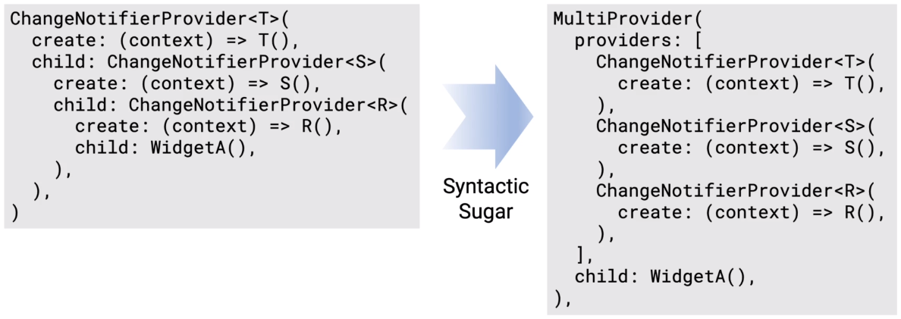

 - SyntacticSugar란 : (용어)기능적으로 동일한데, 문법적으로 좀더 쉽게 재 표현한 스크립트를 말한다.

### 6-2. FutureProvider 정의
1. 기본 syntax
 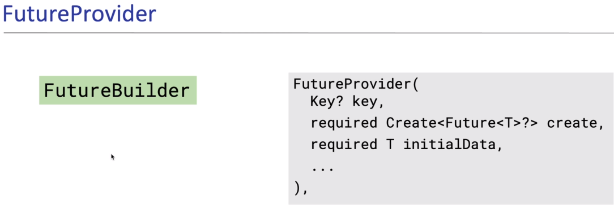

2. FutureBuilder와 유사한 기능으로 동작한다.
3. 만약, 여러게의 연속적인 값에 의해 rebuild하고 싶다면 StreamProvider를 사용한다.
4. error가 발생할 수 있을 경우에는 error method를 제공해야 된다.
 
### 6-3. 주요소스 정의소스
 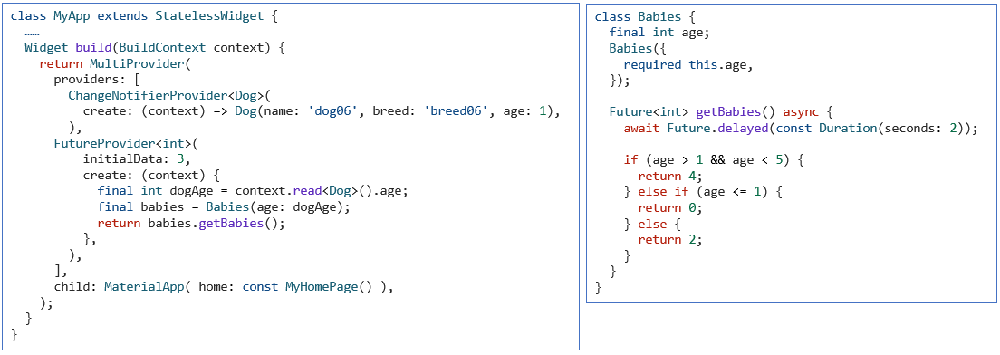

 1. FutureProvider는 Future return value를 type으로 선언한다.
 2. FutureProvider는 Babies.getBabies를 aync로 Future<int>값을 return받아 사용한다.
 3. 바로 return되는 값이 아닌, 미래에 return되는 결과를 받아서 사용하는 경우에 FutureProvider를 사용한다.
 4. 같은 Widget Class에 존재하는 다른 Provider의 값을 사용할 수 있다.

### 6-4. 주요소스 사용소스
 1. context.read<int>(),  
    - FutureProvider선언시 type을 <int>로 했기 때문에 위와 같이 사용된다.
 2. context.watch<int>()
    - 현재 챕터에서는 watch를 기술해도 read와 동일 하다.
    - FutureProvider정의 문장은 한번만 수행되고, Babies class는 ChangeNotifier상속이 안되어 있고, notifyListeners() 호출도 없기 때문이다.

### 6-5. 실행화면
 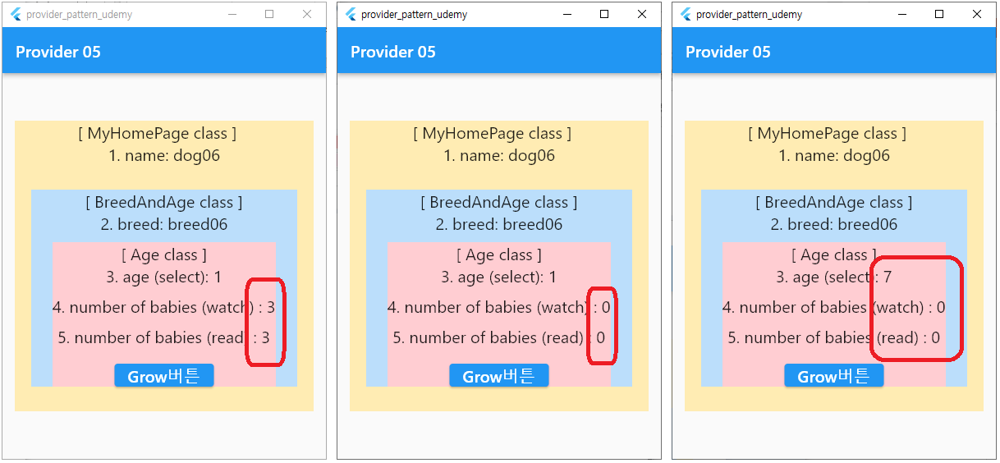

  - 첫번째 이미지   
    . 초기 시작시 화면이다.
  - 두번째 이미지
    . 2초후 결과 화면이다.
  - 세번째 이미지
    . [Grow버튼]을 6번 누른 결과 화면이다.
    . FutureProvider내부의 값들이 변경 되어도 반영되지 않는다. ChangeNotifier상속이 하지 않았기 때문이다.
    . [Grow버튼]클릭 시 Age Widget class는 rebuild는 된다. 하지만 값은 변경되지 않는다.
   
   
   
   
   
   
   
# 7. Dog App만들기 (step7) - (StreamProvider 사용하기)
 ### 7-1 강의
    - https://www.udemy.com/ > Flutter Provider Essential 코스 (Korean)  
    - 14. Chapter 14. StreamProvider
    - [ [참고소스-babies model](./lib/step7_StreamProvider/models/babies.dart) ]
    - [ [참고소스- dog model](./lib/step7_StreamProvider/models/dog.dart) ]
    - [ [참고소스-main](./lib/step7_StreamProvider/dog_app_step7.dart) ]

### 7-2 주요소스
 1. 위 참고소스 참조
 2. StreamProvider는 FutureProvider와 StreamView랑 비슷하기 때문에 상세 설명은 생략한다.

### 7-2 실행화면
 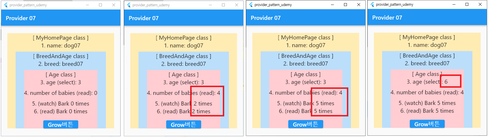

 1. 첫번째 이미지
   - 처음 실행시 화면이다.
 2. 두번째 이미지
   - 3~4초 이후의 실행 화면이다.
 3. 세번째 이미지
   - 5초 이후의 실행 화면이다.
 4. 네번째 이미지
   - [Grow버튼]을 두번 누른 후의 실행 화면이다.


# 8. Dog App만들기 (step8) - (Consumer 사용하기)
 ### 8-1 강의
    - https://www.udemy.com/ > Flutter Provider Essential 코스 (Korean)  
    - 15. Chapter 15. Consumer
    - [ [참고소스-dog model](./lib/step8_Consumer/models/dog.dart) ]
    - [ [참고소스-main](./lib/step8_Consumer/dog_app_step8.dart) ]

### 8-2 Consumer란
 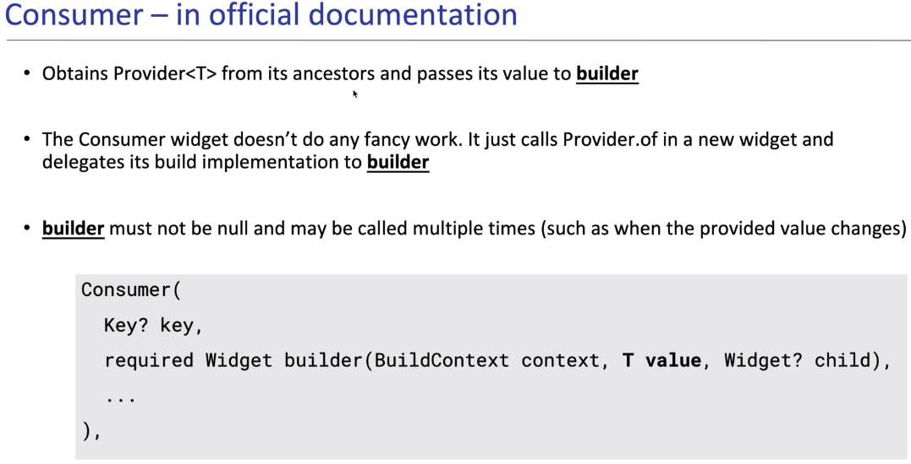
 
 1. 개발자가 Provider.of<T>를 통해서 type T의 object를 얻을 필요가 없다.
 2. builder는 null이 아니여야 하고, 값이 변할 때마다 builder가 호출 되어야 한다.
    - 이 정의라고 하면 rebuild할 필요가 없는 widget들도 다 rebuild가 될 수 있다.
    - 하지만, 이걸 대비해서 Builder() method에는 Nullable type의 Widget? child arg가 있다.
 3. of.context와 Consumer는 성능상으로 완전히 똑같다.
 4. of.context를 사용하고, notifyLisiteners() 가 실행되면 of.context를 사용하는 위젯 전체가 rebuild된다.    
    Consumer는 해당 위젯에서 일부부만 rebuild되도록 설정할 수 있는 것이다.
 5. 만약에 큰 위젯이 존재하면, 따로 쪼개서 of.context를 사용하던가 or    
    Consumer를 사용해서 해당 부분만 rebuild되게 하면 되는 것이다.
 6. 아니면 해당 위젯 전체는 한번만 읽어들인 뒤, 나머지 일부분만 rebuild 되게 하려면
    of.context로 한 뒤에 listen: false 로 구독은 취소해두고, 일부분만 Consumer를 사용하면 된다.

### 8-3 Consumer Syntax
 ```dart
  return Consumer<Dog> (
    builder: (context, dog, child) => {...}
    child:..
  );
 ```
 1. 인수는 3개, context, product, child이다.
 2. context : context아더,
 3. dog(2번째 인수)는 우리가 공유하는 dog instance를 의미한다.
 4. child는 다시 rebuild되지 않는 부분을 의미한다.    
    만약, builder 속성안에 rebuild될 필요가 없는 위젯이 존재 한다면    
    Consumner의 child로 위젯을 이동시키고, builder의 child에는 레퍼런스를 정의한다.

### 8-4 Consumer 실행화면
 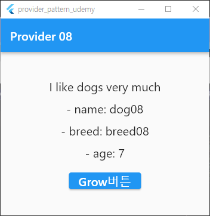
   
   
   
   
   
   
   
   
   
# 9. App만들기 (step9) - (Consumer, builder, ProviderNotFoundException 사용하기)
### 9-1 강의
    - https:/www.udemy.com/ > Flutter Provider Essential 코스 (Korean)  
    - 16. Chapter 16. Consumer, builder, ProviderNotFoundException
    - [ [참고소스-main](./lib/step9_ConsumerException/dog_app_step9.dart) ]

### 9-2 
  - 소스를 만든 이유를 모르겠음.
  - 이해 안가서 skip
   
   
   
   
   
   
   
   
   
# 10. Dog App만들기 (step10) - (Chapter 17. Selector 사용하기)
### 10-1 강의
    - https:/www.udemy.com/ > Flutter Provider Essential 코스 (Korean)  
    - 17. Chapter 17. Selector
    - [ [참고소스-dog model](./lib/step10_Selector/models/dog.dart) ]
    - [ [참고소스-main](./lib/step10_Selector/dog_app_step10.dart) ]

### 10-2 Selector란
 1. Customer Widget과 거의 유사하지만, Customer보다 좀더 세세하게 제어가 가능하다.
 
### 10-3 Selector Syntax
  1. syntax
 ```dart
  return Selector<?,?>({
    Key? key,
    required ValueWidgetBuilder<S> builder,
    required S Function(BuildContext, A) selector,
    ShouldRebuild<S>? shouldRebuild,
    Widget? child,
  })

  context.select<T, R>((R selector(T value)) => R..)
 ```
  2. builder : 
  3. selector
     - A type의 object를 받아서  S type의 value를 return하면 
     - builder: 에서는 S type의 value를 가지고 Widget을 return한다.
     - 

### 10-4 Selector 사용예
```dart
  Selector<Dog, String>(
    selector: (BuildContext context, Dog dog) => dog.name,
    builder: (BuildContext context, String name, Widget? child) {
      return Column(
          children: [
            child!,
            Text('- name: $name', style: const TextStyle(fontSize: 20.0)),
            ElevatedButton(
              onPressed: () => context.read<Dog>().grow(),  child:...
            ),
          ],
      );
    },
    child: const Text('I like dogs very much'),
  ),
```
 1. Selector<Dog, String>
   - 첫번째 Type은 여러게의 속성을 가지고 있는 Model을 정의한다.
   - 두번째 type은 첫번째 Type의 Model속성 중 선택할 Type을 정의한다.
 2. selector: (BuildContext context, Dog dog) 
   - BuildContext와 Provided Argument를 받아서  listen하고자 하는 값을 return한다.
 3. builder: (BuildContext context, String name, Widget? child)
   - 두번째 Arg는 selector의 return값(?)에 대한 data type과 value가 전달된다.
   - 세번째 Arg는 Consumer와 동일하게 Rebuild할 필요가 없는 Widget을 지정한다.
 4. child! 와 Selector의 child
   - 'I like dogs very much' 값은 계속 rebuild될 필요가 없기 때문에 Selector의 child 속성으로 이동시킨다.
 5. context.read<Dog>().grow()
   - grow()는 selector에서 넘겨주는 값이 아니기 때문에 context.read를 통해서 호출 할 수 있다.

### 10-5 Selector 실행화면
 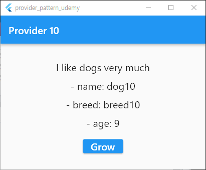
   
      
   
   
      
   
# 11. Counter App만들기 (step11) - (ProviderNotFoundException 확인 및 보정)
    - https:/www.udemy.com/ > Flutter Provider Essential 코스 (Korean)  
    - 18. Chapter 18. ProviderNotFoundException 더 알아보기와 Builder widget
    - [ [참고소스-main](./lib/step11_ProviderNotFoundException/counter.dart) ]
    - [ [참고소스-main](./lib/step11_ProviderNotFoundException/dog_app_step11.dart) ]

### 11-1 ChangeNotifier Syntax
 1. 크게 2가지 방법으로 개발가능하다.
 2. 첫번째 Syntax
  - ChangeNotifierProvider를 먼저 선언하고, 하위 Class Widget부터 사용하기
 ```dart
 //provider_pattern_udemy/step4_CangeNotifierProvider/dog_app_step4.dart
 class MyApp extends StatelessWidget {
  ...
  Widget build(BuildContext context) {
    return ChangeNotifierProvider<Dog>(
      create: (context) => Dog(name: 'dog04', breed: 'breed04'),
      child: MaterialApp(
        home: const MyHomePage(),
      ),);}
}
class _MyHomePageState extends State<MyHomePage> {
  @override
  Widget build(BuildContext context) {
    return Scaffold( ... ),
      body: Text('- name: ${Provider.of<Dog>(context, listen: false).name}')
    );}
}
 ```

3. 두번째 Syntax
  - ChangeNotifierProvider를 선언과 동시에 같은 Widget class에서 사용하기
  - ChangeNotifierProvider를 선언과 동시에 같은 Widget class에서 사용하려고 하면    
    반드시 ChangeNotifierProvider의 child: Builder(builder: (context) { ....}... 와 같이    
    정의 하여야 한다.     
    그렇지 않으면 오류가 발생한다.
   
```dart
//정상script (Builder callback을 사용한 경우)
class MyHomePage extends StatelessWidget {
  ..
  Widget build(BuildContext context) {
    return Scaffold(
      body: ChangeNotifierProvider<Counter>(
        create: (_) => Counter(),
        child: Builder(
          builder: (context) {
            return Column(
              children: [
                Text('${context.watch<Counter>().counter}'),
                ElevatedButton(
                  child: const Text('Increment'),
                  onPressed: () { context.read<Counter>().increment();  },
                )
              ],
            );
   ....
}
```  
```dart
//오류script (Builder callback을 사용하지 않은 경우)
class MyHomePage extends StatelessWidget {
  ..
  Widget build(BuildContext context) {
    return Scaffold(
      body: ChangeNotifierProvider<Counter>(
        create: (_) => Counter(),
        child: Column(
                 children: [
                   //이 context의 상위로 Provider.of를 찾으로 검색해보지만
                   //Provider.of를 찾지 못해서 오류가 발생한다.
                   Text('${context.watch<Counter>().counter}'),
                   ElevatedButton(
                     child: const Text('Increment'),
                     onPressed: () { context.read<Counter>().increment();  },
                   )
                 ],
               ),
   ....
}
```  

### 11-2  실행화면 - 생략
   
      
   
   
      
   
   
# 12. counter App만들기 (step12) - (Provider access - Anonymous route access)
    - https:/www.udemy.com/ > Flutter Provider Essential 코스 (Korean)  
    - 19. Chapter 19. Provider Access – Anonymous route access
    - [ [참고소스-counter model](./lib/step12_AnonymousRouteAccess/counter.dart) ]
    - [ [참고소스-main](./lib/step12_AnonymousRouteAccess/dog_app_step12.dart) ]
    - [ [참고소스-두번째 화면](./lib/step12_AnonymousRouteAccess/show_me_counter.dart) ]

### 12-1 Provider Access 란 
  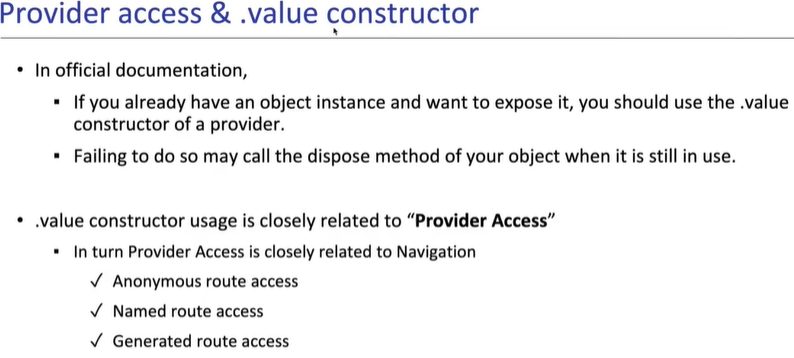

### 12-2 Anonymous route access 개발화면 flow
 - Anonymous route access
 - Provider를 이용해서 다른화면과 model공유 하기
 

### 12-3 Anonymous route access 주요소스
 1. Provider선언
```dart
class MyApp extends StatelessWidget {
  ...
  Widget build(BuildContext context) {
    return MaterialApp(
      home: ChangeNotifierProvider<Counter>(
        create: (context) => Counter(),
        child: const MyHomePage(),
      ),);}
}
``` 

 2. 다른 페이지로 Provider instance넘기기
```dart
  onPressed: () {
    Navigator.push(
      context,
      //builder: (context) 로 작성하면 버튼 클릭 시 오류가 발생한다.
      // ShowMeCounter() class에서 context를 사용할 때
      // router에 있는 builder: (context) 가 아니기 때문이다.
      // 그래서 사용하지 않겠다고 _ 로 처리 한다.
      // _ 대신 counterContext로 해도 된다.
      //MaterialPageRoute(builder: (context) {
      MaterialPageRoute(builder: (_) {
        return ChangeNotifierProvider.value(
          value: context.read<Counter>(),
          child: const ShowMeCounter(),
        );
      }),
    );
  },
``` 
 3. 다른페이지에 Provider를 넘겨 받아 사용하기
```dart
class ShowMeCounter extends StatelessWidget {
  ...
  Widget build(BuildContext context) {
    return Scaffold( ... ),
      body: Center(
        child: Text('${context.read<Counter>().name} = ${context.watch<Counter>().counter}',),
      ),);}
}
```
   
      
   
   
      
   
   
# 13. counter App만들기 (step13) - (Provider access - Named route access)
    - https:/www.udemy.com/ > Flutter Provider Essential 코스 (Korean)  
    - 20. Chapter 20. Provider Access – Named route access
    - [ [참고소스-counter model](./lib/step13_NamedRouteAccess/counter.dart) ]
    - [ [참고소스-main](./lib/step13_NamedRouteAccess/dog_app_step13.dart) ]
    - [ [참고소스-두번째 화면](./lib/step13_NamedRouteAccess/show_me_counter.dart) ]

### 13-2 Named route access 실행화면
 - 위 12 챕터와 화면은 동일
  

### 13-3 Named route access 주요소스
 1. Provider instance생성 및 선언
```dart
class _MyAppState extends State<MyApp> {
  final Counter _counter = Counter();

  @override
  Widget build(BuildContext context) {
    return MaterialApp(
      routes: {
        '/': (context) => ChangeNotifierProvider.value(
              value: _counter,
              child: const MyHomePage(),
            ),
        '/counter': (context) => ChangeNotifierProvider.value(
              value: _counter,
              child: const ShowMeCounter(),
            ),
      },
    );
  }

  //ChangeNotifierProvider 정의시 create에서 Provider instance를 생성하지만
  //Named route access방식에서는 Provider instance를 Member변수로 생성했다.
  //이럴경우에는 자동으로 dispose되지 않기 때문에 개발자가 직접해줘야 된다.
  @override
  void dispose() {
    _counter.dispose();
    super.dispose();
  }
}
```  
 2. 다른페이지에 Provider를 넘겨 받아 사용하기
```dart
class ShowMeCounter extends StatelessWidget {
  ...
  Widget build(BuildContext context) {
    return Scaffold( ... ),
      body: Center(
        child: Text('${context.read<Counter>().name} = ${context.read<Counter>().counter}',),
      ),);}
}
```
    
   
      
   
   
      
   
   
# 14. counter App만들기 (step13) - (Provider access - Generated route access)
    - https:/www.udemy.com/ > Flutter Provider Essential 코스 (Korean)  
    - 21. Chapter 21. Provider Access – Generated route access, Global access
    - [ [참고소스-counter model](./lib/step14_GeneratedRouteAccess/counter.dart) ]
    - [ [참고소스-main](./lib/step14_GeneratedRouteAccess/dog_app_step14.dart) ]
    - [ [참고소스-두번째 화면](./lib/step14_GeneratedRouteAccess/show_me_counter.dart) ]

### 13-2 Generated route access 실행화면
 - 위 12 챕터와 화면은 동일
  

### 13-3 Generated route access 주요소스
 1. Provider instance생성 및 선언
```dart
class _MyAppState extends State<MyApp> {
  final Counter _counter = Counter();

  Widget build(BuildContext context) {
    return MaterialApp(
      onGenerateRoute: (RouteSettings settings) {
        switch (settings.name) {
          case '/':
            return MaterialPageRoute(
              builder: (context) => ChangeNotifierProvider.value(
                value: _counter,
                child: const MyHomePage(),
              ),
            );
          case '/counter':
            return MaterialPageRoute(
              builder: (context) => ChangeNotifierProvider.value(
                value: _counter,
                child: const ShowMeCounter(),
              ),
            );
          default:
            return null;
        }},);}
```
 2. 다른페이지에 Provider를 넘겨 받아 사용하기
```dart
class ShowMeCounter extends StatelessWidget {
  ...
  Widget build(BuildContext context) {
    return Scaffold( ... ),
      body: Center(
        child: Text('${context.read<Counter>().name} = ${context.read<Counter>().counter}',),
      ),);}
}
```
   
      
   
      
      
   
   
      
   
      
      
   
   
      
   
      
      
   
   
      
   
   


# 3. TO DO App 만들기 (step1)
### 1. 사용기능
 - Provider를 사용하지 않고, arguments방식으로 값을 넘겨준다.


# 4. TO DO App 만들기 (step2)
# 5. TO DO App 만들기 (step3)
# 6. TO DO App 만들기 (step4)

# 10. Weather App 만들기


# 20. Firebase Authentication App 만들기


 - Firebase는 다양한 인증방법이 존재 한다.(email/password, anonymouse, social...)
 - 인증관련 상태(login, logout 등)를 실시간으로 stream으로 제공한다.


# 30. Misc
