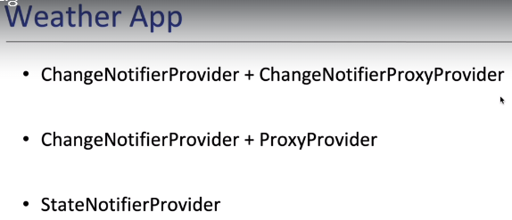

# 1. Provider 정의
### 1. 강의
 - udemy.com
 - 조상욱강사 ()
 - 유튜브 : 헤비프랜 (Heavy Fran)
### 1. 종류


### 2. 정의 및 특징, Topic
 - Provider 는 상태관리자의 기본이다.
 

 1. Why Provider : 왜 provider를 해야 되나    
 2. Accessing data easily : provider를 이용해서 어떻게 widget tree에서 쉽게 data를 access할 것인지 알아보기
 3. Listening to changes in data : widget tree에서 어떻게 data 변경에 대해 listen하는지 알아보기
 4. ChangeNofierProvider : 
 5. read, watch, select extension methods : data를 쉽게 관찰할 수 있는 방법 알아보기
 6. MultiProvider : 여러게 provider 알아보기
 7. FutureProvider : 
 8. StreamProvider : 연속적으로 변하는 값을 listen하고, widget을 rebuild하고 싶을때 하는 방법 알아보기
 9. Consumer :
 10. Selector : Consumer와 widget과 비슷하지만, 좀더 세세하게 제어하는 widget에 대해 알아보기
 11. Provider Access(.value provider) :
 12. ProxyProvider : 한 Provider에서 다른 Provider에 access해야 되는 경우에 사용하는 방법 알아보기
 13. errors : 다양한 error 대처방법
 14. addPostFrameCallback : 
 15. on-time action* & addListener of ChangeNotifier : stat에 변화가 생겼을 때 widget을 rebuild하는 것이 아니라, showdialog나 Navigator.push...등과 같은 action을 ChangeNotifier의 addListener를 활용해 처리하는 방법 알아보기

 * 추가사항    
 16. StateNotifier and StateNotifierProvider : 


### 3. Why Provider
 1. 상태관리자이다.
 2. 사용이유 및 방법
```dart
    - [왼쪽이미지]   
      . WidgetA에 increment method가 존재 하고, counter를 증가시킨다.   
      . 이때 이 counter를 WidgetB에 전달하려면 어떻게 해야 될까?
    - [오른쪽이미지]   
      . WidgetA와 WidgetB에서 필요로하는 함수 및 데이터를 공통Parent인 WidgetC로 옮긴다.
      . 그 함수 및 데이터를 WidgetA 와 WidgetB로 내려준다.
      . Inversion of control 이란 : 함수는 내가(WidgetC) 정의 하는데 실행은 남(WidgetA)이 시킨다.
      . increment method는 WidgetC에 존재 하지만 그 실행은 WidgetA에서 한다.

      . 데이터(counter)를 WidgetC에서 WidgetB로 넘겨줄려면, WidgetD를 거처서 넘겨줘야 된다.
      . 이는 개발에 상당히 불편함이 존재 할 수 있다.
```


# 2. Counter App만들기 (step1) - Provider 미사용
### 1. 정의
 - Provider를 사용하지 않은 counter개발소스 app

### 2. Counter App - Widget Tree 및 실행화면


### 3.  단점
 1. Middle class는 counter값을 사용하지 않는데도, CounterB에 전달하기 위해서 받아서 넘겨줘야 된다.
 2. increment method를 Parent에 정의해야 되고, inversion of control기능을 이용해서 method를 refrence로 넘겨서 수행해야 된다.   
    소스가 직관적이지 않다.
 3. MyHomePage에서 counter값이 변경되고,  setState()를 해야 된다. 이렇게 되면 MyHomePage아래의 모든 Widget Tree가 rebuild된다.
 4. 실재 rebuild되는 소스코드가 해당위치(CounterB)에 존재 하지 않고, 상위에 존재 하기 때문에 소스 Tracking하기가 쉽지 않다.
 5. Widget Tree의 depth가 길어지만 method및 데이터를 계속 전달시켜줘야 된다.


# 3. Dog App만들기 (step2) - Provider 사용 - (ChangeNotifier 미사용)
### 1. 상태관리(State Management) 정의
 1. Dependency Injection기능 사용하기
    - Object를 Widget tree상에서 쉽게 access할 수 있도록 해주는 기능이다.   
 2. Synchronizing data and UI 기능 사용하기
    - 데이터와 UI를 동기화 시켜주는 기능이다.
    - 
### 2. Provider 정의
 1. Provider는 중간(필요없는) widget을 거치지 않고, 필요한 Widget에 쉽게 method및 데이터를 전달할 수 방법을 제공한다.
 2. 필요한 Widget만 rebuilding될 수 있도록 한다.
 3. 다른말로, Business와 Logic을 불리한다 하고도 한다.
    . (BLOC : Business LOgic Component)
 4. Provider를 정의한 상위 Widget에서는 하위 Provider를 사용할 수 없다.
 5. Provider도 Widget이다.


### 3. 개발필요사항
 1. provider: ^6.0.4
 
### 4. 소스 Widget Tree

 
 1. Dos class의 데이터 및 Method를 여러 Widget들에서 필요로 하고 있다.
 2. 사용되고 있는 Widget들의 공통되는 최상위(Parent)에 Provider를 추가한다.

### 5. Provider 기본 문법 - (ChangeNotifier 미사용)
1. Provider Constructor
```dart
  Provider({
    Key? key,
    required Create<T> create,      <<--required
    Dispose<T>? dispose,
    bool? lazy,
    TransitionBuilder? builder,
    Widget? child,
  })
```

### 6. Provider 개발 진행 과정
 1. 하위 Widget들에게 전달하고 싶은 Model 정의
```dart
class Dog {
  final String name;
  final String breed;
  int age;

  Dog({
    required this.name,
    required this.breed,
    this.age = 1,
  });

  void grow() {
    age++;
    notifyListeners();
  }
}
```

 2. Provider 선언
    - 사용되고 있는 Widget들의 공통되는 최상위(Parent)에 Provider를 추가한다.... 라고 했는데    
      개발 되는 소스들을 보면 실제적으로 정의 하는 소스 위치는 공통되는 최상위Widget의 상위이다.
    - 그러면서 Provider() widget의 Child로 공통되는 최상위 Widget을 위치시키는 구성으로 되어 있다.
```dart
class MyApp extends StatelessWidget {
  ...
  Widget build(BuildContext context) {
    return Provider<Dog>(
      create: (context) => Dog(name: 'Sun',breed: 'Bulldog',age: 3),
      child: MaterialApp(....
        home: const MyHomePage(),
      ),
    );
  }
}
```

 3. 하위 Widget에서 Provider기능 사용하기
   - Provider에는 of라는 static함수가 존재 한다.
   - 이 of함수는 Widget tree를 위로 traverse 하면서 원하는 type의 instance를 찾아서 주는 역할을 담당한다.   
     그래서 of함수에는 찾고자 하는 Type의 instance를 줘야 된다.    
   - of함수의 argument로는 context를 줘야 된다.
     context를 주는 이유는 context를 통해 Widget tree를 위로 탐색해야 되기 때문이다.
   - Provider.of<Dog>(context) : 와 같이 기술하게 되면 Dog class의 instance를 제공해 준다.
   - Provider.of<T>(context) : T type의 instance를 제공해 준다.

```dart
 Text('- name: ${Provider.of<Dog>(context).name}'), 
```

  4. [grow]버튼을 눌러도 화면에는 아직 나이가 올라가지 않는다.

# 4. Dog App만들기 (step3) - (Provider 미사용 )- (ChangeNotifier 사용)
 1. Provider를 사용하지 않았기 때문에 Dog instance를 필요한 Widget들에게 argument로 넘겨 주고 있다.

 2. ChangeNotifier 상속받아 사용하기
  - notifyListeners()라는 void method : 를 기술하게 되면 
  - ChangeNotifier에 의해 상속받은 class의 값이 변동 되었을때,   
    notifyListeners()라는 void method를 호출하게 되면      
    ChangeNotifier를 listen하고 있는 모든 Widget들에게 변동사항을 알려준다.   
  - listener 등록방법   
    . ChangeNotifier에는 addListener()를 method가 있는데 이 method를 통해 callback함수를 등록하면 된다.   
    . 이렇게 callback함수로 등록 되면 ChangeNotifier로 상속받은 class가 변경이 되면      
      매번 호출 하게 된다.   
  - addListener() 주의사항   
    . Widget이 종료 될때 listen하고 있는 widget들이 자동으로 dispose되지 않기 때문에 반드시 dispose를 해줘야 된다.    
    . removeListener() method를 이용한다.  

 

 3. [grow]버튼을 눌러도 화면에는 아직 나이가 올라가지 않는다.

 4. 주요소스
    - 이 챕터의 주요소스는 다음챕터에서 처리
    - 이 챕터는 다음 챕터를 개발하기 위한 지나가는 과정 이기 때문에 소스는 기술하지 않겠다.

# 4. Dog App만들기 (step4) - (ChangeNotifierProvider 사용)


# 3. TO DO App 만들기 (step1)
### 1. 사용기능
 - Provider를 사용하지 않고, arguments방식으로 값을 넘겨준다.


# 4. TO DO App 만들기 (step2)
# 5. TO DO App 만들기 (step3)
# 6. TO DO App 만들기 (step4)

# 10. Weather App 만들기



# 20. Firebase Authentication App 만들기


 - Firebase는 다양한 인증방법이 존재 한다.(email/password, anonymouse, social...)
 - 인증관련 상태(login, logout 등)를 실시간으로 stream으로 제공한다.


# 30. Misc
