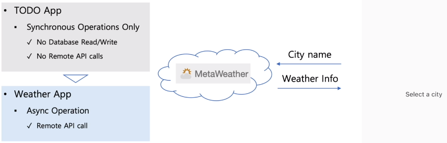
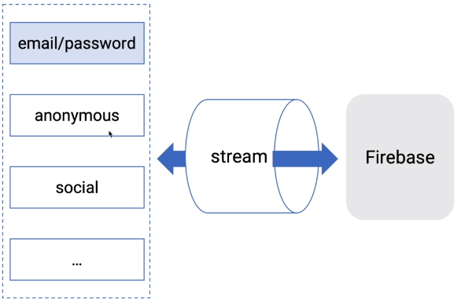
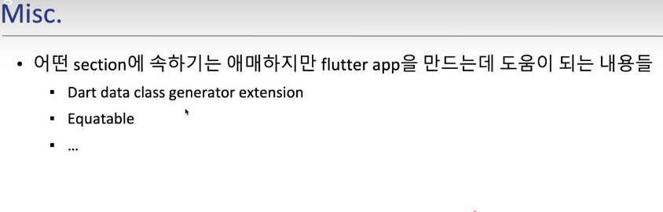

# 15. ProxyProvider 개요
### 15-1 강의
 - https:/www.udemy.com/ > Flutter Provider Essential 코스 (Korean)  
 - 22. Chapter 22. ProxyProvider 개요 1   
   23. Chapter 23. ProxyProvider 개요 2   
### 15-1 ProxyProvider Syntax
```dart
  ProxyProvider({
      Key? key,
      Create<R>? create,
      required ProxyProviderBuilder<T, R> update,
      UpdateShouldNotify<R>? updateShouldNotify,
      Dispose<R>? dispose,
      bool? lazy,
      TransitionBuilder? builder,
      Widget? child,
    })
```
 1. create
    - 한번만 호출 된다.
    - create가 optional 한 이유는 다른 Provider에서 사용하기 위해서만 필요하다면 사용하지 않아도 된다.
     
 2. update
    - 여러번 호출 될 수 있다.
    - ProxyProvider는 다른 provider의 value에 의존하기 때문이다.
 3. update가 호출 되는 3가지 조건
    - 첫번째, ProxyProvider가 의존하는 Provider의 value를 처음으로 얻을 때
    - 두번째, ProxyProvider가 의존하는 Provider의 value가 변경 될때 마다
    - 세번째, ProxyProvider가 rebuild될 때 마다
          
### 15-2 ProxyProvider 정의
 1. 다른 Provider의 값을 사용할 수 있다.
 2. ProxyProvider는 다른 provider의 value에 의존한다.   
    즉, 다른 value가 변하게 되면 새로 만들어야 된다는 뜻이다.

### 15-3 ProxyProvider - update
 1. ProxyProvider 
      

  - update: 속성
    . update 속성의 typedef가 오른쪽 회색 script이다.
    . ProxyProvider의 update callback은   
      BuildContext, Type T의 value, Nullable type의 Type R의 Previous를 arg로 3개를 받아서    
      Type R의 value를 return한다.
      * 이때 왜 R이 Nullable이나면 create가 optional 이기 때문이다.
  - super(update: )속성 - arg2개 짜리 update가 arg3개 짜리 update를 return한다.

 2. ProxyProvider2
      

  - update: 속성
    . update 속성의 typedef가 오른쪽 회색 script이다.
    . ProxyProvider의 update callback은   
      BuildContext, Type T의 value, Type T2의 value, Nullable type의 Type R의 Previous를 arg로 4개를 받아서    
      Type R의 value를 return한다.
      * 이때 왜 R이 Nullable이나면 create가 optional 이기 때문이다.
 - super(update: )속성 - arg2개 짜리 update가 arg4개 짜리 update를 return한다.   
      
 2. ProxyProviderN
    


 ### 15-4 ChangeNotifierProxyProvider
  - ChangeNotifierProxyProvider는 외부 ChangedNotifier와 값을 Synchronize하는 ChangeNotifierProvider이다.
     

 ### 15-4 ChangeNotifierProxyProvider 주의할점      
    
   
   
   
   
   
   
   
# 15. ProxyProvider 
### 15-0 강의
 - https:/www.udemy.com/ > Flutter Provider Essential 코스 (Korean)  
 - 24. Chapter 24. ProxyProvider 예제 1   
   25. Chapter 25. ProxyProvider 예제 2   
   26. Chapter 26. ProxyProvider 예제 3   
   27. Chapter 27. ProxyProvider 예제 4   
 - [ [개발소스-main 화면](./lib/step15_ProxyProvider/dog_app_step15.dart) ]


### 15-0 ProxyProvider - Main화면
    
  

### 15-1 ProxyProvider - 1. Why ProxyProvider 버튼
 1. 소스
 - [ [개발소스-why_proxyprov 화면](./lib/step15_ProxyProvider/pages/why_proxyprov.dart) ]

 2. 정의
 - ProxyProvider를 사용않아 2개의 Model간의 값 전달을 할 수 없다.
 - [INCREASE]버튼을 눌러도 화면에 숫자가 변경이 안됨
 - ProxyProvider를 사용하지 않아서 이다.
 
 3. 실행화면
 

 4. Widget Tree
 

 5. 주요소스
 ```dart
class Translations {
  final int _value;
  const Translations(this._value);

  String get title => 'You clicked $_value times';
}
 ```
 ```dart
 class _WhyProxyProvState extends State<WhyProxyProv> {
  int counter = 0;
  void increment() { setState(() { counter++;}); }

  Widget build(BuildContext context) {
    return Scaffold(
      body: Center(
        child: Provider<Translations>(
          create: (_) => Translations(counter),
          child: Column(
            children: [
              const ShowTranslations(),
              IncreaseButton(increment: increment),
            ],
          ),),),);}
}
```
```dart
  class ShowTranslations extends StatelessWidget {
    Widget build(BuildContext context) {
      return Text(Provider.of<Translations>(context).title);
    }
  }

  class IncreaseButton extends StatelessWidget {
    final VoidCallback increment;
    ....
    Widget build(BuildContext context) {
      return ElevatedButton(
        onPressed: increment,
        child: Text('INCREASE'),);}
  }  
```

 - Provider의 create: callback함수는 한번만 호출 된다.
 - ShowTranslations() Widget class에서 'title'을 출력 시 처음 생성당시의 값만 계속 보여주게 된다.
 - counter의 변경된 값이 Translations instance에 전달하지 못한다.

### 15-2 ProxyProvider0 (update사용하고_- 2. ProxyProvider update 버튼
 1. 소스
 - [ [개발소스-화면](./lib/step15_ProxyProvider/pages/proxyprov_update.dart) ]

 2. 정의
 3. 실행화면
    

 4. Widget Tree
 5. 주요소스
```dart
class Translations {
  final int _value;
  const Translations(this._value);

  String get title => 'You clicked $_value times';
}
```
```dart
class _ProxyProvUpdateState extends State<ProxyProvUpdate> {
  int counter = 0;
  void increment() {  setState(() { counter++; }); }

  Widget build(BuildContext context) {
    return Scaffold(
      body: Center(
        child: ProxyProvider0<Translations>(
          update: (_, __) => Translations(counter),
          child: Column(
            children: [
              ShowTranslations(),
              SizedBox(height: 20.0),
              IncreaseButton(increment: increment),
            ],),),),);}
}
```
```dart
  class ShowTranslations extends StatelessWidget {
    Widget build(BuildContext context) {
      return Text(Provider.of<Translations>(context).title);
    }
  }

  class IncreaseButton extends StatelessWidget {
    final VoidCallback increment;
    ....
    Widget build(BuildContext context) {
      return ElevatedButton(
        onPressed: increment,
        child: Text('INCREASE'),);}
  }  
```
 - ProxyProvider0 Widget을 사용하였다.
 - update: 속성이 다시 호출 되는 조건 중 -> `세번째, ProxyProvider가 rebuild될 때 마다` 이다.   
   setState(){} 호출이 되면서 rebuild가 된다. 이때 update: callback함수가 호출 된다.
 


### 15-3 ProxyProvider0 (create, update 사용하기) - 3. ProxyProvider create/update 버튼
 1. 소스
 - [ [개발소스-화면](./lib/step15_ProxyProvider/pages/proxyprov_create_update.dart) ]

 2. 정의
 3. 실행화면
 

 4. Widget Tree
 5. 주요소스
```dart
class Translations {
  late int _value;
  void update(int newValue) { _value = newValue; }
  String get title => 'You clicked $_value times';
}
```
```dart
class _ProxyProvCreateUpdateState extends State<ProxyProvCreateUpdate> {
  int counter = 0;
  void increment() { setState(() { counter++; }); }

  Widget build(BuildContext context) {
    return Scaffold(
      body: Center(
        child: ProxyProvider0<Translations>(
          create: (_) => Translations(),
          update: (_, Translations? translations) {
            translations!.update(counter);
            return translations;
          },
          child: Column(
            children: [
              ShowTranslations(),
              IncreaseButton(increment: increment),
            ], ), ), ), ); }
}
```
```dart
  class ShowTranslations extends StatelessWidget {
    Widget build(BuildContext context) {
      return Text(context.watch<Translations>().title);
    }
  }

  class IncreaseButton extends StatelessWidget {
    final VoidCallback increment;
    ....
    Widget build(BuildContext context) {
      return ElevatedButton(
        onPressed: increment,
        child: Text('INCREASE'),);}
  }  
```
 - ProxyProvider0 을 사용한다.
 - create: arg의 callback에서 Translations() instance를 생성 해서 update: 속성의 arg로 넘겨준다.
 - update: 의 두번째 arg는 create: 에서 생성한 후 return한 instance를 받는다.
    
 - counter값이 변하면서 setState(){}를 실행하여 rebuild될때 update: callback함수를 계속 실행하도록 해 준다.
 - 이런 과정으로 하위 Widget class에 변경된 값을 받아 출력할 수 있도록 해 준다.

 - 이 방식은 좋은 방식은 아니다.
 - 다음 15-4 방식이 좋은 방식중 하나 이다.

### 15-4 MultiProvider - 4. ProxyProvider ProxyProvider 버튼
 1. 소스
 - [ [개발소스-화면](./lib/step15_ProxyProvider/pages/proxyprov_proxyprov.dart) ]

 2. 정의
 3. 실행화면
    

 4. Widget Tree
 5. 주요소스
```dart
class Translations {
  const Translations(this._value);
  final int _value;
  String get title => 'You clicked $_value times';
}
```
```dart
class _ProxyProvProxyProvState extends State<ProxyProvProxyProv> {
  int counter = 0;

  void increment() {
    setState(() {
      counter++;
      print('counter: $counter');
    });
  }

  @override
  Widget build(BuildContext context) {
    return Scaffold(
      body: Center(
        child: MultiProvider(
          providers: [
            ProxyProvider0<int>( update: (_, __) => counter, ),
            ProxyProvider<int, Translations>(  update: (_, value, __) => Translations(value), ),],
          child: Column(
            children: [
              ShowTranslations(),
              IncreaseButton(increment: increment),
            ],),),),);}
}
```dart
  class ShowTranslations extends StatelessWidget {
    Widget build(BuildContext context) {
      return Text(context.watch<Translations>().title);
    }
  }

  class IncreaseButton extends StatelessWidget {
    final VoidCallback increment;
    ....
    Widget build(BuildContext context) {
      return ElevatedButton(
        onPressed: increment,
        child: Text('INCREASE'),);}
  }  
```
 - 정의 MultiProvider를 사용하여, 하나는 변화하는 값을 return하는 ProxyProvider를 정의하고,    
   두번째 ProxyProvider는  첫번째 ProxyProvider에서 return하는 값을 받아서   
   새로운 Object를 creation하는 형태로 만든다.
 - `ProxyProvider0<int>( update: (_, __) => counter, ),`
   . ProxyProvider0 에서 변화하는 counter를 return하고
 - `ProxyProvider<int, Translations>(  update: (_, value, __) => Translations(value), ),],`
   . value는 변화에 의존하는 값이다.
   . ProxyProvider에서 ProxyProvider0에서 return한 counter값을  value로 받아서 Translations(value)를 생성한다.
 - MultiProvider > child: 속성의 Widget에서는 providers: 에서 생성 후 return 한 `Translations(value)`를 사용할 수 있게 된다.

### 15-5 ChangeNotifierProvider - 5. ChangeNotifierProvider ChangeNotifierProxyProvider 버튼
 1. 소스
 - [ [개발소스-화면](./lib/step15_ProxyProvider/pages/chgnotiprov_chgnotiproxyprov
.dart) ]
 2. 정의
 3. 실행화면
    

 4. Widget Tree
 5. 주요소스
```dart
class Counter with ChangeNotifier {
  int counter = 0;
  void increment() {
    counter++;
    notifyListeners();
  }
}

class Translations with ChangeNotifier {
  late int _value;
  void update(Counter counter) {
    _value = counter.counter;
    notifyListeners();
  }
  String get title => 'You clicked $_value times';
}
``` 
 - 2개의 Model를 생성 하고, ChangeNotifier로 mixin 후    
   값이 변경 시 notifyListeners()를 이용해 listener들에게 통보한다.

```dart
class ChgNotiProvChgNotiProxyProv extends StatefulWidget { ... }

class _ChgNotiProvChgNotiProxyProvState extends State<ChgNotiProvChgNotiProxyProv> {
  Widget build(BuildContext context) {
    return Scaffold(
      body: Center(
        child: MultiProvider(
          providers: [
            ChangeNotifierProvider<Counter>( create: (_) => Counter(), ),
            ChangeNotifierProxyProvider<Counter, Translations>(
              create: (_) => Translations(),
              update: (
                BuildContext _,
                Counter counter,
                Translations? translations,
              ) {
                translations!..update(counter);
                return translations;
              },
            ),
          ],
          child: Column(
            children: [
              ShowTranslations(),
              IncreaseButton(),
            ], ), ), ), ); }
}
```
 - `ChangeNotifierProvider<Counter>( create: (_) => Counter(), ),`
   . Counter instance 생성
 - `ChangeNotifierProxyProvider<Counter, Translations>...`
   . Counter instance에 의존하는 Translations instance를 create: 속성에서 생성하고
   . update: callback에서는 Counter instance가 변할 때 마다    
     translations 의 update 함수를 호출하고    
     이때 arg로 변화하는 counter값을 넘겨준다.
   . 위와 같은 과정이 완료 되면 생성된 translations 를 return한다.
 - MultiProvider > child: 속성의 Widget에서는 providers: 에서 생성 후 return 한 `translations` instance를 사용할 수 있게 된다.

```dart
class ShowTranslations extends StatelessWidget {
  Widget build(BuildContext context) {
    return Text(context.watch<Translations>().title);
  }
}

class IncreaseButton extends StatelessWidget {
  Widget build(BuildContext context) {
    return ElevatedButton(
      onPressed: () => context.read<Counter>().increment(),
      child: Text( 'INCREASE' ), ); }
}
```

 - 
 - 
 - 
 - 
 - 

### 15-6 ProxyProvider - 6. ChangeNotifierProvider ProxyProvider 버튼
 1. 소스
 - [ [개발소스-화면](./lib/step15_ProxyProvider/pages/chgnotiprov_proxyprov.dart) ]
 2. 정의
 3. 실행화면
    

 4. Widget Tree
 5. 주요소스
```dart
class Counter with ChangeNotifier {
  int counter = 0;
  void increment() {
    counter++;
    notifyListeners();
  }
}

class Translations {
  const Translations(this._value);
  final int _value;
  String get title => 'You clicked $_value times';
}
```
```dart
class ChgNotiProvProxyProv extends StatefulWidget { .. }

class _ChgNotiProvProxyProvState extends State<ChgNotiProvProxyProv> {
  Widget build(BuildContext context) {
    return Scaffold(
      body: MultiProvider(
          providers: [
            ChangeNotifierProvider<Counter>( create: (_) => Counter(), ),
            ProxyProvider<Counter, Translations>(
              update: (_, counter, __) => Translations(counter.counter),
            ),
          ],
          child: Column(
            children: [
              ShowTranslations(),
              IncreaseButton(),
            ], ), ), ); }
}
```
 - `ChangeNotifierProvider<Counter>( create: (_) => Counter(), ),`
   . Counter instance를 생성하는 ChangeNotifierProvider를 정의한다.
 - `ProxyProvider<Counter, Translations>...`
   . ProxyProvider는 Counter instance가 변할 때마다 Translations instance를 생성하기 때문에   
     create는 필요가 없다.
   . update: callback에서는 ChangeNotifierProvider에 의해서 생성된 Counter instance를 arg로 받아서   
     Translations instance를 생성할 수 있는 생성자에 변화하는 counter.counter값을 넘겨준다.
   . 마지막으로 변화하는 값을 arg로 받아 생성된 Translations instance를 return한다.
 
```dart
class ShowTranslations extends StatelessWidget {
  Widget build(BuildContext context) {
    return Text(context.watch<Translations>().title);
  }
}

class IncreaseButton extends StatelessWidget {
  Widget build(BuildContext context) {
    return ElevatedButton(
      onPressed: () => context.read<Counter>().increment(),
      child: Text( 'INCREASE' ), ); }
}
```

   
   
   
   
   
   
   
   
   
   
   
   
   
   
   
   
   
   
   
   
   
   
   
   
   
# 3. TO DO App 만들기 (step1)
### 1. 사용기능
 - Provider를 사용하지 않고, arguments방식으로 값을 넘겨준다.


# 4. TO DO App 만들기 (step2)
# 5. TO DO App 만들기 (step3)
# 6. TO DO App 만들기 (step4)

# 10. Weather App 만들기



# 20. Firebase Authentication App 만들기



 - Firebase는 다양한 인증방법이 존재 한다.(email/password, anonymouse, social...)
 - 인증관련 상태(login, logout 등)를 실시간으로 stream으로 제공한다.


# 30. Misc
