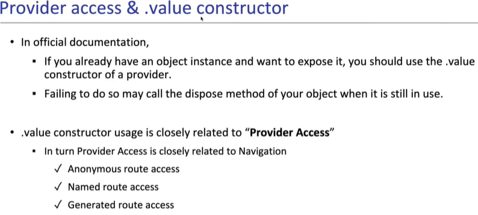
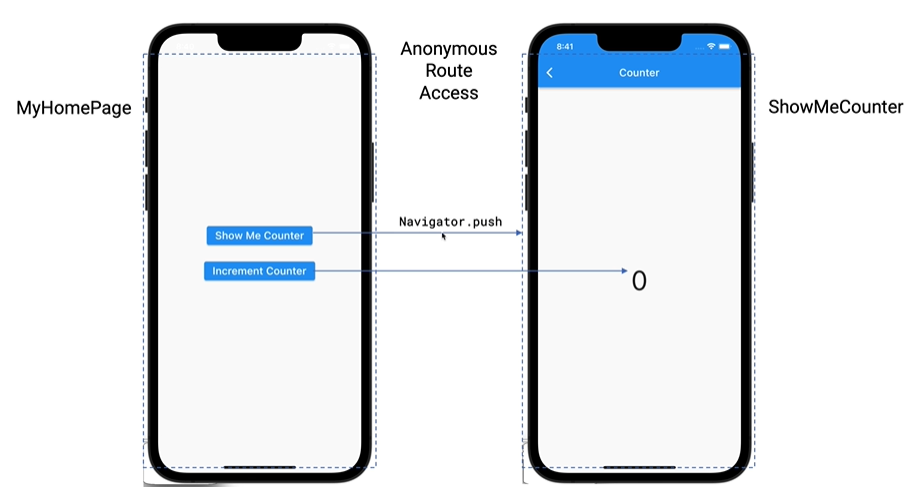

# 1. Provider Route Access 종류
 1. Anonymous Route Access
 2. Named Route Access
 3. Generated Route Access
 4. Global Route Access

# 2. counter App만들기 (step12) - (Provider access - Anonymous route access)
### 2-0 강의
    - https:/www.udemy.com/ > Flutter Provider Essential 코스 (Korean)  
    - 19. Chapter 19. Provider Access – Anonymous route access
    - [ [개발소스-counter model](./lib/step12_AnonymousRouteAccess/counter.dart) ]
    - [ [개발소스-main](./lib/step12_AnonymousRouteAccess/dog_app_step12.dart) ]
    - [ [개발소스-두번째 화면](./lib/step12_AnonymousRouteAccess/show_me_counter.dart) ]

### 2-1 Provider Access 란 
  

### 2-2 Anonymous route access 개발화면 flow
 - Anonymous route access
 - Provider를 이용해서 다른화면과 model공유 하기
 

### 2-3 Anonymous route access 주요소스
 1. Provider선언
```dart
class MyApp extends StatelessWidget {
  ...
  Widget build(BuildContext context) {
    return MaterialApp(
      home: ChangeNotifierProvider<Counter>(
        create: (context) => Counter(),
        child: const MyHomePage(),
      ),);}
}
``` 

 2. 다른 페이지로 Provider instance넘기기
```dart
  onPressed: () {
    Navigator.push(
      context,
      //builder: (context) 로 작성하면 버튼 클릭 시 오류가 발생한다.
      // ShowMeCounter() class에서 context를 사용할 때
      // router에 있는 builder: (context) 가 아니기 때문이다.
      // 그래서 사용하지 않겠다고 _ 로 처리 한다.
      // _ 대신 counterContext로 해도 된다.
      //MaterialPageRoute(builder: (context) {
      MaterialPageRoute(builder: (_) {
        return ChangeNotifierProvider.value(
          value: context.read<Counter>(),
          child: const ShowMeCounter(),
        );
      }),
    );
  },
``` 
 3. 다른페이지에 Provider를 넘겨 받아 사용하기
```dart
class ShowMeCounter extends StatelessWidget {
  ...
  Widget build(BuildContext context) {
    return Scaffold( ... ),
      body: Center(
        child: Text('${context.read<Counter>().name} = ${context.watch<Counter>().counter}',),
      ),);}
}
```
   
      
   
   
      
   
   
# 3. counter App만들기 (step13) - (Provider access - Named route access)
### 3-1 강의
    - https:/www.udemy.com/ > Flutter Provider Essential 코스 (Korean)  
    - 20. Chapter 20. Provider Access – Named route access
    - [ [개발소스-counter model](./lib/step13_NamedRouteAccess/counter.dart) ]
    - [ [개발소스-main](./lib/step13_NamedRouteAccess/dog_app_step13.dart) ]
    - [ [개발소스-두번째 화면](./lib/step13_NamedRouteAccess/show_me_counter.dart) ]

### 3-2 Named route access 실행화면
 - 위 12 챕터와 화면은 동일
  

### 3-3 Named route access 주요소스
 1. Provider instance생성 및 선언
```dart
class _MyAppState extends State<MyApp> {
  final Counter _counter = Counter();

  @override
  Widget build(BuildContext context) {
    return MaterialApp(
      routes: {
        '/': (context) => ChangeNotifierProvider.value(
              value: _counter,
              child: const MyHomePage(),
            ),
        '/counter': (context) => ChangeNotifierProvider.value(
              value: _counter,
              child: const ShowMeCounter(),
            ),
      },
    );
  }

  //ChangeNotifierProvider 정의시 create에서 Provider instance를 생성하지만
  //Named route access방식에서는 Provider instance를 Member변수로 생성했다.
  //이럴경우에는 자동으로 dispose되지 않기 때문에 개발자가 직접해줘야 된다.
  @override
  void dispose() {
    _counter.dispose();
    super.dispose();
  }
}
```  
 2. 다른페이지에 Provider를 넘겨 받아 사용하기
```dart
class ShowMeCounter extends StatelessWidget {
  ...
  Widget build(BuildContext context) {
    return Scaffold( ... ),
      body: Center(
        child: Text('${context.read<Counter>().name} = ${context.read<Counter>().counter}',),
      ),);}
}
```
    
   
      
   
   
      
   
   
# 4. counter App만들기 (step13) - (Provider access - Generated route access)
### 4-1 강의
    - https:/www.udemy.com/ > Flutter Provider Essential 코스 (Korean)  
    - 21. Chapter 21. Provider Access – Generated route access, Global access
    - [ [개발소스-counter model](./lib/step14_GeneratedRouteAccess/counter.dart) ]
    - [ [개발소스-main](./lib/step14_GeneratedRouteAccess/dog_app_step14.dart) ]
    - [ [개발소스-두번째 화면](./lib/step14_GeneratedRouteAccess/show_me_counter.dart) ]

### 4-2 Generated route access 실행화면
 - 위 13 챕터와 화면은 동일
  

### 4-3 Generated route access 주요소스
 1. Provider instance생성 및 선언
```dart
class _MyAppState extends State<MyApp> {
  final Counter _counter = Counter();

  Widget build(BuildContext context) {
    return MaterialApp(
      onGenerateRoute: (RouteSettings settings) {
        switch (settings.name) {
          case '/':
            return MaterialPageRoute(
              builder: (context) => ChangeNotifierProvider.value(
                value: _counter,
                child: const MyHomePage(),
              ),
            );
          case '/counter':
            return MaterialPageRoute(
              builder: (context) => ChangeNotifierProvider.value(
                value: _counter,
                child: const ShowMeCounter(),
              ),
            );
          default:
            return null;
        }},);}
```
 2. 다른페이지에 Provider를 넘겨 받아 사용하기
```dart
class ShowMeCounter extends StatelessWidget {
  ...
  Widget build(BuildContext context) {
    return Scaffold( ... ),
      body: Center(
        child: Text('${context.read<Counter>().name} = ${context.read<Counter>().counter}',),
      ),);}
}
```
    
   
      
   
   
      
   
   
# 5 Global Route Access
 1. 주요소스
 ```dart
  return Provider<T> (
    create: (_) => T(),
    child: MaterialApp(..)
  );
 ```   
